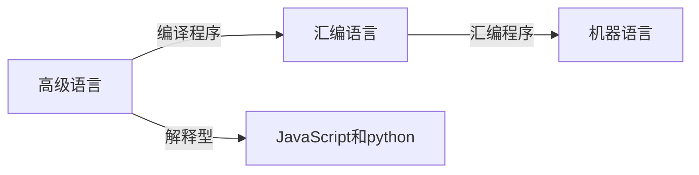

[toc]

# 一. 计算机习题概述

计算机概述：计算机系统$=$硬件$+$软件

硬件：计算机的物理性能，决定计算机性能天花板在哪

软件：计算机的虚拟性能，决定硬件性能可以发挥到什么程度。可分为系统软件和应用软件：

- 系统软件：用来管理整个计算机系统。如：操作系统，DBMS，服务程序等。
- 应用软件：按任务需要编制成的各种程序。如：微信，QQ等。

计算机功能好坏取决于"软"，"硬"件功能的总和。计算机组成原理重点讨论硬件内容。

计算硬件发展：

计算机目前的发展趋势：一方面向**更微型、多用途**方向发展；另一方面向**更巨型，超高速**方向发展。

## 1.计算机硬件的基本组成

### 1.1 冯诺依曼结构

提出设想：

> 提出"存储程序的概念"：将指令以二进制的形式先输入计算机的主存储器，然后按其在存储中的首地址执行程序的第一条指令，以后就按该程序的规定顺序执行其他指令，直到程序执行结束。

​																						 [冯诺依曼机](https://z3.ax1x.com/2021/10/11/5ZzPzD.png)

处理步骤：

1. 输入设备：将信息转化成机器能识别的形式
2. 存储器：存放数据和程序
3. 运算器：算术运算和逻辑运算
4. 控制器：指挥程序运行 
5. 输出设备：将结果输出

> 在计算机系统中，软件和硬件在逻辑上是等效的。对于同一个功能，既可以用软件实现也可以用硬件实现，但用软件实现成本低，效率也低；而用硬件实现成本高，效率也高。如：对于乘法运算，可以设计一个专门的硬件电路实现乘法运算也可以用软件的方式，执行多次加法运算来实现。

冯诺依曼计算机的特点：

1. 计算机由五大部件组成
2. 指令和数据以同等地位存于存储器，可按地址寻访
3. 指令和数据用二进制表示
4. 指令由操作码(如：加减乘除)和地址码组成
5. 存储程序：会提前将指令和程序存放到存储器中
6. 以运算器为中心：输入$/$输出设备与存储器之间的数据传送通过运算器完成。由于运算器还要完成数据中转操作，所以执行效率会降低。

### 1.2 现代计算机结构

现代计算机结构本质上是冯诺依曼结构的优化。

优化后的冯诺依曼结构：

传统冯诺依曼结构是以运算器为中心，数据传输都需要通过运算器作为中转。而现代计算机通常以存储器为中心，同时运算器和控制器之间的联系也十分紧密，所以将其结合起来就是CPU。即**CPU$=$运算器$+$控制器**。

现代计算机结构：

$I/O$设备会直接和主存储器进行数据交换。

控制器控制运算器进行数据操作(如：加减乘除)，另外也会控制主存储对CPU的读写，及输入输出设备的停止和启动。

主存储器会和CPU之间进行数据交换：一种是参与运算的数据(如：$x,y$之类的变量)。另一种是放在控制器中的指令，指令会由控制器解析其含义。

主存储器和CPU统称为主机。

现代计算机硬件结构：

上面比较混淆的是主存和辅存：这两个都是存储器，主存就是主存储器(如：运行内存)，包含在主机内；而辅存指辅助存储器(如：机械硬盘)，属于$I/O$设备。

​																		[现代冯诺依曼结构](https://z3.ax1x.com/2021/10/11/5eSbDJ.png)

[总结](https://z3.ax1x.com/2021/10/11/5epWse.png)：

## 2.各个硬件功能概况

### 2.1 主存储器

主存储器由三个部分构成：

1. 存储体：相当于"货架"部分，存储二进制数据，并根据$MAR$发送的数据地址，取出数据。
2. MAR(存储地址寄存器)：CPU将想要的数据地址存放到MAR中，即数据地址。
3. MDR(存储数据寄存器)：将存储体中取出的数据，写入MDR中，CPU可以通过数据线路从MDR中拿走数据。

存储步骤是：CPU将数据地址放入MAR中，将数据放入MDR中，之后存储体根据CPU指令将MDR中数据放入MAR指定的存储体地址中。

读取步骤是：CPU将读取地址放入MAR，存储体根据CPU指令将MAR中对应地址在存储体中找到并写入MDR中，CPU再从MDR中读取数据。

重点在存储体上：数据按地址存放在存储体中。

存储体结构：

> 存储单元：每个存储单元存放一串二进制代码。
>
> 存储字(word)：存储单元中二进制代码的组合。
>
> 存储字长：存储单元中二进制代码的位数（如：8bit，16bit，32bit，64bit）。
>
> 存储元：存储二进制的电子原件，每个存储元可存1bit。

数据在存储体中按地址存储，类似于Excel的一列表格。每个表格代表一个存储单元，每个存储单元存放一串二进制代码称为存储字，每个存储字包含多少个二进制位称为存储字长。

==注：==MAR位数反映存储单元的个数，MDR位数$=$存储字长。

例1：MAR$=$4位$\Longrightarrow$总共有$2^4$个存储单元。(4位的排列组合：4！=4`*`3*2`*`1=24)

例2：MDR$=$16位$\Longrightarrow$每个存储单元可存放$16bit$，1个字(word) $=16bit$。

==计算机基本单位：==

- 位$/$字（bit）：最小的数据单位
- 字节（Byte）：如果计算机硬件是$8$位，那么：$8$个字(bit)组成一个字节(1B$=$8b)，存储空间的最小单位。
- B：1B=8b，K：1KB = 1024B，M：1MB=1024KB，G：1GB=1024MB，T,P,E

### 2.2 运算器

用于实现算术运算(如：加减乘除)、逻辑运算(如：与或非)

有四部分构成：

- ACC：累加器，用于存放操作数，或运算结果。

- MQ：乘商寄存器，在乘除运算时，用于存放操作数或运算结果。

- X：通用的操作数寄存器，用于存放操作数。

- ALU(核心部件)：算术逻辑单元，通过内部复杂的电路实现算术运算、逻辑运算。是运算器的核心单元。

ACC、MQ、X在进行加减乘除操作区别：

|      |     加     |     减     |       乘       |      除      |
| :--: | :--------: | :--------: | :------------: | :----------: |
| ACC  | 被加数、和 | 被减数、差 |    乘积高位    | 被除数、余数 |
|  MQ  |            |            | 乘数、乘积低位 |      商      |
|  X   |    加数    |    减数    |     被乘数     |     除数     |

### 2.3 控制器

指挥各个部件，使程序可以正常运行

主要有三部分构成：

- CU(核心元件)：控制单元，分析指令，给出控制信号。是控制器核心元件。
- IR：指令寄存器，存放当前执行的指令
- PC：程序计数器，存放下一条指令的地址，有自动加$1$的功能

代码相当于指令，每完成一条指令过程：

1. 取指令(PC)

   根据PC中所记录的指令地址，从内存中取出该指令。

2. 分析指令(IR)

   将取出的指令由IR进行分析这条指令可以干什么。

3. 执行指令(CU)。

   分析完成后CU会控制其他部件完成指令具体执行。

程序在计算机中的运行过程：

> 运行顺序：PC$\Longrightarrow$MAR$\Longrightarrow$MDR$\Longrightarrow$IR$\Longrightarrow$CU$\Longrightarrow$IR$\Longrightarrow$MAR$\Longrightarrow$MDR$\Longrightarrow$ACC		

例：给定以下高级语言分析其在计算机内执行过程。

~~~C++
int a=2,b=3,c=1,y=0;
void main(){
    y=a*b+c;
}
~~~

代码在主存结构如下：

地址$0\sim4$是`y=a*b+c`这段程序对应的机器指令；地址$5\sim8$是四个变量$a,b,c,y$的的存储情况。这里存储字长为$16bit$。

运行步骤：

- 首先PC$=0$，执行主存地址为$0$的第一行的指令

  

  （1）$PC$存放的内容会通过地址总线传送到$MAR$中，即$(PC)\xrightarrow{0}MAR$，此时$(MAR)=0$。也就是控制器向主存指明接下来要访问的是$0$号地址所对应的指令。同时控制器会通过控制总线向主存发送读操作指令。

  （3）接着主存会根据$MAR$记录的地址到存储体中取出$0$号地址对应的二进制数据，并将二进制数据放入$MDR$当中。即$主存(MAR)\rightarrow MDR$，此时$(MDR)=000001\quad 0000000101$

  （4）$(MDR)$中存放的数据就是指令，所以这条指令会通过数据总线放入$IR$中。即$(MDR)\rightarrow IR$，导致$(IR)=000001\quad 0000000101$

  （5）$(IR)\xrightarrow{000001}CU$，$IR$将前六位的指令操作码($000001$)发送到$CU$中，$CU$分析后得知，这是取数指令。

  （6）$(IR)\xrightarrow{0000000101}MAR$，将$IR$中的数据地址码发送给$MAR$，导致$(MAR)=5$。因为$0000000101$转化十进制是$5$

  （8）$主存(MAR)\xrightarrow{5}MDR$，导致$(MDR)=0000000000000010=2$。主存根据$MAR$地址找到数据放入$MDR$中

  （9）最后在控制单元的指挥下$MDR$中的数据会被存放到$ACC$中。$(MDR)\xrightarrow{0000000000000010=2}ACC$，导致$(ACC)=0000000000000010=2$

  上面七步操作完成后$a=2$代码执行完毕。其中$1,3,4$是取指令；$5$是分析指令；$6,8,9$执行取数指令。

- 在上述取指令动作完成后，由于$PC$具有自动加$1$的功能，所以$(PC)=1$，即执行主存地址为$1$的第二行的指令

  

  此时$(PC)=1$，$(ACC)=\{a=2\}$

  （1）$PC\xrightarrow{1}MAR$，导致$(MAR)=1$

  （3）$主存(MAR)\rightarrow MDR$，导致$(MDR)=000100\quad0000000110$

  （4）$(MDR)\rightarrow IR$，导致$(IR)=000100\quad0000000110$

  （5）$(IR)\xrightarrow{000100}CU$，$IR$将前六位指令操作码$(000100)$发送给$CU$，$CU$分析后得知，这是**乘法**指令

  （6）$(IR)\xrightarrow{0000000110}MAR$，将$IR$中数据的地址吗发送到$MAR$，导致$(MAR)=0000000110=6$

  （8）$主存(MAR)\xrightarrow{6}MDR$，导致$(MDR)=0000000000000011=3$

  （9）$主存(MDR)\xrightarrow{3}MQ$，将$MDR$中的值放入乘商寄存器$MQ$当中

  （10）将$(ACC)\xrightarrow{a=2}X$，将$ACC$中$a$的值$2$放入通用寄存器$X$当中。导致$(X)=2$

  （11）$CU$通过控制线向$ALU$发送相乘指令。$(MQ)*(X)\xrightarrow{2*3=6}ACC$，导致$(ACC)=6$，如果乘积太大，需要$MQ$辅助存储。

  上面九步操作完成后$a*b$代码执行完毕。其中$1,3,4$是取指令；$5$是分析指令；$6,8,9,10,11$执行**乘法**指令。

- 在上述取指令动作完成后，由于$PC$具有自动加$1$的功能，所以$(PC)=2$，即执行主存地址为$2$的第三行的指令

  

  此时$(PC)=2$，$(ACC)=\{6\}$

  （1）$PC\xrightarrow{2}MAR$，导致$(MAR)=2$

  （3）$主存(MAR)\rightarrow MDR$，导致$(MDR)=000011\quad000000011$

  （4）$(MDR)\rightarrow IR$，导致$(IR)=000011\quad000000011$

  （5）$(IR)\xrightarrow{000011}CU$，$IR$将前六位指令操作码$(000011)$发送给$CU$，$CU$分析后得知，这是**加法**指令

  （6）$(IR)\xrightarrow{000000011}MAR$，将$IR$中数据的地址吗发送到$MAR$，导致$(MAR)=000000011=7$

  （8）$主存(MAR)\xrightarrow{7}MDR$，导致$(MDR)=0000000000000001=1$

  （9）当进行加法运算的时候$(ACC)$中会先存入被加数，通用寄存器会存放加数。$(MDR)\xrightarrow{1}X$，$(X)=1$

  （10）$CU$向$ALU$发送相加指令。$ALU$将$(ACC)$中的值与$(X)$中的值相加，再放回$(ACC)$。$(ACC)+(X)\xrightarrow{6+1=7}ACC$。导致$(ACC)=7$。

  上面八步操作完成后$a*b+c$代码执行完毕。其中$1,3,4$是取指令；$5$是分析指令；$6,8,9,10$执行**相加**指令。

- $PC$自动加$1$，所以$(PC)=3$，即执行主存地址为$3$的第四行的指令

  

  此时$(PC)=3$，$(ACC)=\{7\}$

  （1）$PC\xrightarrow{3}MAR$，导致$(MAR)=3$

  （3）$主存(MAR)\rightarrow MDR$，导致$(MDR)=000010\quad000001000$

  （4）$(MDR)\rightarrow IR$，导致$(IR)=000010\quad000001000$

  （5）$(IR)\xrightarrow{000010}CU$，$IR$将前六位指令操作码$(000010)$发送给$CU$，$CU$分析后得知，这是**存数**指令

  （6）$(IR)\xrightarrow{000001000}MAR$，将$IR$中数据的地址吗发送到$MAR$，导致$(MAR)=000001000=8$

  （7）将$ACC$中的结果通过数据总线送到$MDR$中。$(ACC)\xrightarrow{7}MDR$，$(MDR)=7$

  （9）由于是存数指令，所以$CU$会将$MDR$中的数据，存放在$MAR$所指定的地址中。$(MDR)\xrightarrow{7}地址为8的存储单元$。故$y=7$

  上面七步操作完成后$y=a*b+c$代码执行完毕。其中$1,3,4$是取指令；$5$是分析指令；$6,7,9$执行**存数**指令。

- $PC$自动加$1$，所以$(PC)=4$，即执行主存地址为$4$的第五行的指令

  

  此时$(PC)=4$

  （1）$PC\xrightarrow{4}MAR$，导致$(MAR)=4$

  （3）$主存(MAR)\rightarrow MDR$，导致$(MDR)=000110\quad000000000$

  （4）$(MDR)\rightarrow IR$，导致$(IR)=000110\quad000000000$

  （5）$(IR)\xrightarrow{000110}CU$，$IR$将前六位指令操作码$(000110)$发送给$CU$，$CU$分析后得知，这是**停机**指令

  利用中断机制通知操作系统终止该进程。

总结：

> OP：操作码
>
> AD：地址码
>
> CPU区分指令和数据的依据：根据指令周期的不同阶段

​																										[运行汇总](https://z3.ax1x.com/2021/10/12/5nPqyV.png)

​																										[汇总二](https://z3.ax1x.com/2021/10/12/5nF48s.png)

### 2.4 计算机层次结构

最底层：由传统机器(机器语言的机器)和微程序机器(微指令系统)组成。

这一层传统机器执行二进制机器指令，而机器指令可以分解为多个微指令，微程序机器就是执行这些微指令的。

再上一层是：虚拟机器(汇编语言机器)

汇编语言编写的代码需要翻译成机器码，所以是虚拟机器。

再上一层是：虚拟机器(高级机器语言)

需要用编译程序翻译成汇编语言。

而我们编写的程序往往需要用到操作系统的调用，向上提供广义指令。

所以总的计算机层次：

计算机层次结构特点：**下层是上层的基础，上层是下层的扩展**

> 计算机硬件层：微程序机器MO(微指令系统)------>传统机器M1(用机器语言的机器)
>
> 计算机软件层：虚拟机器M2(操作系统机器)------>虚拟机器M3(汇编语言机器)------>虚拟机器M4(高级语言机器)

硬件层位于最底层，具有下层是上层的基础，上层是下层的扩展的特点。

编译型程序：将高级语言编写的源程序全部语句一次全部翻译成机器语言程序，而后再执行机器语言程序（只需翻译一次)

解释型程序：将源程序的一条语句翻译成对应于机器语言的语句，并立即执行。紧接着再翻译下一句(每次执行都要翻译)

注意：编译、汇编、解释程序可以统称为翻译程序。

## 3. 计算机的性能指标

### 3.1 存储器的性能指标

主寄存器的容量$=$存储单元的个数$\times$存储字长bit

  > 例：MAR为$32$位，MDR为$8$位，总容量$=2^{32}*8=4GB$

### 3.2 CPU的性能指标

- CPU的主频：CPU内数字脉冲信号震荡的频率，很大程度上反映了CPU的性能。如：$2.9GHZ$，$3.7GHZ$

  可以理解为指挥CPU内部部件工作的节奏。

  [CPU震荡图：](https://z3.ax1x.com/2021/10/12/5nywnJ.png)

  

  其中每个脉冲信号的时间称为CPU的**时钟周期**(微秒，纳秒)

  > CPU主频与时钟周期关系：==CPU主频(时钟频率)$=\frac{1}{CPU时钟周期(赫兹)}$==	。即==时钟周期$=$CPU主频的倒数==
  >
  > $2.9GHZ$代表CPU在一秒可以执行$2.9*10^{9}$个周期。

- CPU执行时间：表示CPU执行一般程序所占用的CPU时间，可用下式计算：
  $$
  CPU执行时间=CPU时钟周期数\times CPU时钟周期
  $$

- CPI：指执行一条指令所需的时钟周期数

  CPI性能是变化的：不同的指令，CPI不同。甚至相同的指令，CPI也可能有变化。 

  > 执行一条指令的耗时$=$ ==$CPI*CPU时钟周期$==

  例：某CPU主频为1000Hz，某程序包含100条指令，平均来看指令的$CPI=3$。该程序在该CPU上执行需要多久?
  $$
  \begin{equation*}
  	\begin{aligned}
  \\\Large{解:}\\
  &总耗时=CPI*\frac{1}{CPU主频(时钟频率)}\\
  \\
  &\therefore 100\times\frac{1}{1000}\times3=0.3s
  	\end{aligned}
  \end{equation*}
  $$

  > CPU执行时间(一个程序的耗时)$=\frac{(指令条数*CPI)}{主频(时钟周期)}=\frac{CPU时钟周期数}{主频}$

- MIPS：每秒执行多少(百万)条指令

  $MIPS=\frac{主频}{平均CPI}=\frac{指令数}{程序执行时间\times 10^6}$

  单位：单位一般在指标名称前。如：KIPS、MIPS

- FLOPS：每秒执行多少次浮点运算

  $FLOPS=\frac{程序中浮点操作次数}{程序执行时间(s)}$

  **单位：**单位一般在指标名称前。如：KPS、MPS、KFLOPS$\cdots\cdots$

  **注：**此处K、M、G、T为数量单位。即$K=千=10^3$、$M=百万=10^6$、$G=十亿=10^9$、$T=万亿=10^{12}$

若对于一个给定的程序，$I_N$表示执行程序中的指令数，$t_{CPU}$表示执行该程序所需要的CPU时间，$T$为时钟周期数，$f$为时钟频率($T$的倒数)，$N_C$为CPU时钟周期数。设$CPI$表示每条指令的平均时钟周期数，$MIPS$表示每秒钟执行的百万条指令数，对应的表达式如下：
$$
\begin{equation*}
	\begin{aligned}
&t_{CPU}=\frac{N_C}{f}=N_C\times T=\Big(\sum_{i=1}^{n}CPI_{i}\times I_{i}\Big)\times T\\
\\
&CPI=\frac{N_C}{I_N}=\sum_{i=1}^n\Big(CPI_i\times\frac{I_i}{I_N}\Big)\\
\\
&MIPS=\frac{I_N}{t_{CPU}\times10^6}=\frac{f}{CPI\times10^6}\\
\\
&N_C=\sum_{i=1}^n\Big(CPI_i\times I_i\Big)
	\end{aligned}
\end{equation*}
$$

> $\frac{I_i}{I_N}$表示$i$指令在程序中所占比例。

$\Large 例:$用一台$50$MHz处理机执行标准测试程序，它包含的混合指令数和相应所需的平均时钟周期数如下所示：

| 指令类型 | 指令数目 | 平均时钟周期数 |
| :------: | :------: | :------------: |
| 整数运算 |  45000   |       1        |
| 数据传送 |  32000   |       2        |
| 浮点运算 |  15000   |       2        |
| 控制传送 |   8000   |       2        |

$$
\begin{equation*}
	\begin{aligned}
\\\Large{解:}\\
&CPI=\frac{N_C}{I_N}=\frac{45000\times1+32000\times2+15000\times2+8000\times2}{45000+32000+15000+8000}=1.55(周期/指令)\\
\\
&MIPS=\frac{f}{CPI\times10^6}=\frac{50\times10^6}{1.55\times10^6}\approx 32.26(百万条指令/秒)\\
\\
&t_{CPU}=\frac{N_C}{f}=\frac{45000\times1+32000\times2+15000\times2+8000\times2}{50\times10^6}=31\times10^{-4}(s)
	\end{aligned}
\end{equation*}
$$

### 3.3 系统整体性能指标

  - 数据通路带宽

    > 是数据总线一次所能并行传送信息的位数（各硬件部件通过数据总线传输数据)

    CPU与内存和$I/O$设备之间的信息传输都是通过数据总线传输的。如：一台计算机的数据通路带宽为$8bit$要从存储体中读出$16bit$信息需要两次。所以数据通路带宽会直接影响到各个部件之间传输的效率。

  - 吞吐量

    > 吞吐量：指系统在单位时间内处理请求的数量。如：网站处理用户请求。
    >
    > 它取决于信息能多快地输入内存，CPU能多快地取指令，数据能多快地从内存取出或存入，以及所得结果能多快地从内存送给一台外部设备。这些步骤中的每一步都关系到主存，因此，系统吞吐量主要取决于主存的存取周期。

  - 响应时间

    > 响应时间:指从用户向计算机发送一个请求，到系统对该请求做出响应并获得它所需要的结果的等待时间。
    >
    > 通常包括CPU时间(运行一个程序所花费的时间）与等待时间（用于磁盘访问、存储器访问、$I/O$操作、操作系统开销等时间)。

- 基准程序

  基准程序是用来测量计算机处理速度的一种实用程序，以便于被测量的计算机性能可以与运行相同程序的其它计算机性能进行比较。常见的基准程序有各类跑分软件。
  
- 利用率

  在给定的事件间隔内系统被实际使用的时间所占的比率，用百分比表示。

- 总线宽度

  一般指CPU中运算器与存储器之间进行互连的内部总线二进制位数

- 处理机字长

  指处理机运算器中一次能够完成二进制数运算的位数，比如：$32$位、$64$位。

- 存储器容量

  存储器中所有存储单元的总数目。通常用$KB$、$MB$、$GB$、$TB$表示。

- 存储器带宽

  单位时间内从存储器读出的二进制数信息量，一般用字节数$/$秒表示

**注：**

1. 主频高的CPU不一定比主频低的CPU快。如两个CPU，$A$的主频为$2GHz$，平均$CPI=10$；$B$的主频$1GHz$，平均$CPI=1$。所以$B$虽然主频低，但是$CPI$处理快，总体比$A$快。
2. 若两个CPU的平均CPI相同，频率高的CPU也不一定快。还要看指令系统，如$A$不支持乘法指令，只能用多次加法实现乘法；而$B$支持乘法指令。
3. 基准程序(跑分软件)执行得越快也不能说明机器性能越好：基准程序中的语句存在频度差异，运行结果也不能完全说明问题

### 3.4 总结

​																						[计算机性能指标](https://z3.ax1x.com/2021/10/13/5MVr8S.png)

# 二. 数据的表示与运算

## 1. 进位计数制

十进制

如：$975.36$

其可以表示为：$9\times10^2+7\times10^1+5\times10^{0}+3\times10^{-1}+3\times10^{-2}$

由十进制可以推广到多进制。

### 1.1 $r$进制转化为十进制

基数：每个数码位所用到的不同符号的个数，十进制基数是$0\sim9$，$r$进制的基数为$0\sim r$。

下面是一些常见进制的基数：

> 二进制：$0,1$
>
> 八进制：$0,1,2,3,4,5,6,7$
>
> 十进制：$0,1,2,3,4,5,6,7,8,9$
>
> 十六进制：$0,1,2,3,4,5,6,7,8,9,A,B,C,D,E,F$

$r$进制转化为十进制例题：

1. 二进制($B$)：$101.1\xrightarrow{转换为十进制}$$1\times2^2+0\times2^1+1\times2^0+1\times2^{-1}=5.5$
2. 八进制(O)：$5.4\xrightarrow{转换为十进制}$$5\times8^0+4\times8^{-1}=5.5$
3. 十进制($D$)：$5.5\xrightarrow{转换为十进制}$$5\times10^0+5\times10^{-1}=5.5$
4. 十六进制($0X/H$)：$5.8\xrightarrow{转换为十进制}$$5\times16^0+8\times16^{-1}=5.5$

计算机用二进制好处是：

1. 可使用两个稳定状态的物理器件表示。
2. $0$，$1$正好对应逻辑值假、真。方便实现逻辑运算。
3. 可很方便地使用逻辑门电路实现算术运算。

### 1.2 二进制转化为八进制和十六进制

- 二进制转化为八进制

  > 从小数点开始向两端**三位一组**(因为最大排列为八)，不够补零：小数点左边不够三位向左边补零；右边不够三位向右边补零。每组转换成十进制，再由十进制得到对应的八进制符号
  >
  > 例：1111000010.01101
  >
  > ==<u>001</u>== ==<u>111</u>== ==<u>000</u>== ==<u>010</u>== . ==<u>011</u>== ==<u>010</u>==				
  >
  > 1	  7      0     2   .   3     2 

  八进制转化为二进制

  > 每位八进制对应三位的二进制	
  >
  > $(251.5)_8$$\xrightarrow{转换为二进制}$(010 101 001.101)~2~
  >
  > 具体：$2\xrightarrow{二进制}010$、$5\xrightarrow{二进制}101$、$1\xrightarrow{二进制}001$、$5\xrightarrow{二进制}101$

- 二进制转化为十六进制

  > **四位一组**(最大的排列为十六)，每组转换成十进制，再由十进制得到对应的十六进制符号
  >
  > 例子：1111000010.01101
  >
  > ==<u>0011</u>==	==<u>1100</u>==	==<u>0010</u>== . ==<u>0110</u>==	 ==<u>1000</u>==
  >
  > 3		  C		  2    .     6           8

- 十六进制转化为二进制

  > 每位十六进制对应四位二进制

>$(AE86.1)_{16}\xrightarrow{转换为二进制}$(1010 1110 1000 0110.0001)~2~
>
>具体是：$A\xrightarrow{转换为二进制}1010$、$E\xrightarrow{转换为二进制}1110$、$8\xrightarrow{转换为二进制}1000$、$6\xrightarrow{转换为二进制}0110$、$1\xrightarrow{转换为二进制}0001$

- 八进制与十六进制互换

  这两者之间的转换可以借助十进制或者二进制完成，可以先将八进制转换成十进制或二进制，再转换成十六进制。通过间接转换来实现。

### 1.3 十进制转化任意进制

- 整数部分转换（除基取余法）：$\frac{十进制数}{r进制}=商\cdots 余数$，之后一直除$r$直到商为$0$，再将余数倒叙排列即可。

  [75转二进制：](https://z3.ax1x.com/2021/10/14/51tY2F.png)

  [															](https://imgtu.com/i/51tY2F)

- 小数部分转化（乘基取整法）：$十进制数\times r进制=小数D$，再**取走**小数的整数部分再乘$r$进制，直到最后小数$D=原十进制数或者等于0.0$即可，最后正序排序取走整数部分即可。

  注意：有的十进制小数无法用二进制精确表示，我们一般当$D=原十进制数$时停止。

  [$0.3$转换为二进制：]()

  

- 也可以将十进制转换为二进制，然后二进制再转换为八进制或十六进制。

  [进制速查表：](https://z3.ax1x.com/2021/10/14/51tcxe.png)

  

### 1.4 真值和机器数

十进制$+15$转换为二进制需要再前面加一位符号位，正号用$0$，负号用$1$。所以$+15\xrightarrow{二进制}0\quad1111$，$-15\xrightarrow{转换为二进制}1\quad1000$

> 真值：实际的带正负号的数值(人类习惯的样子)。如上面的$+15$和$-15$
>
> 机器数︰把正负号数字化的数(存到机器里的样子)。如上面的$0\quad1111$和$1\quad1000$

## 2. BCD码

BCD码指：用二进制编码的十进制数。主要有：**$8421$码**、余$3$码、$2421$码。

由于机器数(二进制)转换为真值(十进制)过程较为麻烦，而BCD码就是为了解决这个问题。

BCD码原理：可以用$4bit$对应一个十进制位。因为$4bit$对应有$2^4=16$种状态，完全可以表示$0\sim9$这十种情况。同时也会与六种状态是冗余的。

### 2.1 8421码

$8421$码是指四位二进制位，来表示一个十进制。这四个二进制位的权重分别是$8、4、2、1$。如表示$5\xrightarrow{8421码}0101$，因为从左至右第二位$4$和最后一位$1$相加等于$5$

$0\sim9$的$8421$码表：

根据上面表$985\xrightarrow{8421码}1001\quad1000\quad0101$。可以用三个$8421$码表示$985$这个数字

$8421$码的加法运算：

$5(0101)+8(1000)=13(0001\quad0011)_{8421码}$

计算机做法是首先将两个码二进制相加$5(0101)+8(1000)=13(1101)$，显然$1101$已经超出$8421$码$0\sim9$的范围，即不在映射表中。实际上当结果处于$10(1010)\sim15(1111)$内是没有定义的，是一个非法$8421$码区间。解决做法是让结果码$13(1101)+6(0110)$，由于加$6$后这四个数肯定会向高位进$1$，此时低位部分就是我们需要个位数$3$。所以$13(1101)+6(0110)=19(1\quad0011)$，低位$0011\xrightarrow{转换为十进制}3$。而高位$1$我们只需要在前面补上$3$个$0$，即$0001$，最终$1(0001)\quad 3(0011)$正好可以表示$13$这个数，所以上面$5+8$用$8421$表示是$0001\quad0011$。

再看一种情况：对于$9(1001)+9(1001)=18(10010)$结果已经大于$8421$码定义的四位。处理方法同样是后四位加$6$，即$0010+0110=1\quad1000$。低位的$(1000)_{8421码}\xrightarrow{十进制}8$，即个位。前面高位$1$前面补足三个$0$。最终$0001\quad1000$。所以$9(1001)+9(1001)=18(0001\quad1000)_{8421码}$

总结：只要相加结果处于$10(1010)\sim18(10010)$这个区间都需要加$6$修正。如果在合法范围内无需修正。

### 2.2 其他码

- 余$3$码

  在$8421$码基础上每个数$+3(0011)_{2}$

  

  余$3$码每个进制位并没有权值。

- $2421$码

  和$8421$码一样是一个有权码，四位二进制码的权值分别是$2,4,2,1$

  

  需要注意的是对于$2421$码，其$0\sim4$第一位都是$0$，而$5\sim9$第一位都是$1$。这是因为要避免歧义性。

## 3. 无符号整数的表示和运算

无符号整数即自然数，有$0,1,2\cdots$

无符号整数的表示：假设现在机器字长是$8$位，那么其通用寄存器只能存$8$位。

如：$255\xrightarrow{二进制}11111111$，刚好八位，可以存放在机器字长是$8$位的寄存器中。

但$256\xrightarrow{二进制}100000000$，二进制是九位，而机器字长$8$位，其在计算机中只能保存低八位，即$00000000$。

而这八位都有权值，没有符号位，所以称为无符号整数。

无符号整数特点：

1. 全部二进制位都是数值位，没有符号位，第$i$位的位权是$2^i-1$
2. $n$比特的无符号整数表示范围是$0\sim2^{n}-1$，超出则溢出，意味着该计算机无法一次处理这么多位
3. 可以表示的最小的数是：所有位全是$0$，最大的的数是：所有位全是$1$。

无符号整数的加法：从最低位开始，按位相加，并往更高位进位。如：$99(01100011)_{2}+9(00001001)$，其实二进制位相加即可。

无符号整数的减法：

- 首先"被减数"不变，"减数"全部位**按位取反、最后一位$+1$**，减法变加法
- 从最低位开始，按位相加，并往更高位进位

如：$99(01100011)_{2}-9(00001001)$

首先减数$00001001\xrightarrow{按位取反}11110110$，之后$11110110$的最后一位$+1$，即$11110111$

最后计算$01100011+11110111=90(101011010)$，由于计算结果是九位，寄存器只能存储八位，所以舍弃高位的$1$，结果是$01011010$

## 4. 带符号整数在计算机中应用

带符号整数，如：$-2,-1,0,1,2\cdots$

带符号整数可以用**原码、反码、补码**三种不同编码方式来表示。

带符号整数的表示：假设现在机器字长是$8$位，那么其通用寄存器只能存$8$位。最多只能同时进行$8$位运算

### 4.1 原码表示法

开头第一位是符号位：正号用$0$，负号用$1$，剩下后七位是数值位。

如：真值$+19\xrightarrow{二进制}+10011$，在$8bit$寄存器中存储方式是$0,0010011$

真值$-19\xrightarrow{二进制}-10011$，在$8bit$寄存器中存储方式是$1,0010011$

原码特性：

1. 若机器字长是$n+1$位，带符号整数的**原码表示范围**：$-(2^n-1)\le x\le2^n-1$
2. 符号位$0/1$对应$正/负$，剩余的数值位表示真值的绝对值
3. **真值$0$有两种形式**：$+0$和$-0$。$[+0]_{原}=0,0000000$；$[-0]_{原}=1,0000000$

原码缺点：符号位不能参与运算，需要设计复杂的硬件电路才能处理。

### 4.2 原码计算方式

原码加法计算方式是：先将原码$\xrightarrow{转换}$反码$\xrightarrow{转换}$补码。在进行正常二进制计算即可。

正数转换为补码不变

负数(原码)$\xleftrightarrow{符号位不变,数值位取反}$反码$\xrightarrow{末位+1}$补码

==原码转换为补码快速技巧==：原码从右往左找到第一个$1$，这个$1$左边的数值位按位取反就可以变为补码。同样补码转换为原码方式一样。

如：$[-19]_{原}=1,0010011$转换为补码$[-19]_{补}=1,1101101$

计算机硬件如何做补码的加法：从最低位开始，按位相加(符号位参与运算)， 并往更高位进位。

注意：负数补码的数值为不能解读成位权。我们需要将其转换为原码。

如上面$[-38]_{补}=1,1011010\xrightarrow{转换为原码}1,0100110$，而$1,0100110\xrightarrow{十进制}-38$

而对应原码的减法计算，仍需要将其转换为补码再计算。不同的是计算机只能处理加法运算，所以将减法变为加法即可。如$[A]_{补}-[B]_{补}=[A]_{补}+[-B]_{补}$

所以只需要解决已知一个补码求其负值的补码。==方法是==：$[B]_{补}\xrightarrow{全部位按位取反,末位+1}[-B]_{补}$

如：$[19]_{补}\xrightarrow{全部位按位取反}[11101100]\xrightarrow{末位+1}[11101101]_{补}=[-19]_{补码}$

同样有快速转换的技巧：原码从右往左找到第一个$1$，这个$1$左边的**全部位**按位取反就可以变为负值补码。

可以看出有符号整数减法和无符号整数减法方法一样，这样就意味着可以用同一套电路就可以实现处理所有加减法。

所以有符号整数的减法：

- 首先"被减数"不变，"减数"全部位**按位取反、最后一位$+1$**，减法变加法
- 从最低位开始，按位相加，并往更高位进位

[原码计算总结：](https://image.sybblogs.fun/img-common/202401091356634.png)

注意：计算机内部所有带符号整数的加减法都要先转换为补码形式。

### 4.3 移码

移码：在补码$[A]_{补}$基础上，符号位取反就可以得到移码$[B]_{移}$。

注意：移码只能表示整数，不能表示小数。且真值$0$只有一种表示形式$10000000$，若机器字长为$n+1$位，移码整数的范围：$-2^n\le x\le2^n-1$

### 4.4 原码、补码、反码和无符号整数特性

|       $n+1bit$       |       合法表示范围       |         最大的数          |         最小的数          |                      真值$0$的表示                       |
| :------------------: | :----------------------: | :-----------------------: | :-----------------------: | :------------------------------------------------------: |
|  带符号的整数：原码  | $-(2^n-1)\le x\le 2^n-1$ |  $0,111\cdots111=2^n-1$   | $1,111\cdots111=-(2^n-1)$ | $[+0]_{原}=0,000\cdots000$ $-[0]_{原}=1,000\cdots000$ |
|   带符号整数：反码   | $-(2^n-1)\le x\le2^n-1$  |  $0,111\cdots111=2^n-1$   | $1,000\cdots000=-(2^n-1)$ | $[+0]_{反}=0,000\cdots000$ $[-0]_{反}=1,111\cdots111$ |
| 带符号整数：==补码== |   $-2^n\le x\le 2^n-1$   |  $0,111\cdots111=2^n-1$   |   $1,000\cdots000=-2^n$   |     $[0]_{补}=0,000\cdots000$ 真指$0$只有一种补码     |
|   带符号整数：移码   |   $-2^n\le x\le 2^n-1$   |   $1111\cdots111=2^n-1$   |   $0000\cdots000=-2^n$    |     $[0]_{移}=1000\cdots000$ 真值$0$只有一种移码      |
|      无符号整数      |   $0\le x\le2^{n+1}-1$   | $1111\cdots111=2^{n+1}-1$ |     $0000\cdots000=0$     |                     $0000\cdots000$                      |

原码和反码的合法表示范围完全相同，都有两种方法表示真值$0$

补码和移码的合法表示范围比原码多一个负数，只有一种方法表示真值$0$

常见考点：两个数$A$和$B$进行某种运算后，是否发生溢出。可以手算做题可以带入十进制验证，是否超出合法范围

如：计算机是$8$位。$A=B=-64$，如果其用原码表示$A+b=-128$会溢出。而用补码表示则不会溢出。

[几种码的表示：]()

### 4.5 定点小数表示和运算

之前的定点整数，即带符号的整数，小数点隐含在数值部分末尾。

而定点小数小数点位置是在符号位和数值位中间

定点小数的编码有原码、反码和补码。没有移码。并且定点小数各个位权与定点整数不一样。除符号位，由高位到低位$2^{-1},2^{-2},2^{-3}\cdots$

如：$[x]_{原}=1.1100000$

定点小数原码、反码补码转换和定点整数一样。其计算方法也一样。

定点小数和定点整数对比：

### 4.6 奇偶校验码

数据在计算机内部进行计算存取过程中可能会发生错误，所以要用到校验。

奇校验码：整个校验码(有效信息位和校验位)中$1$的个数为奇数。

偶校验码：整个校验码(有效信息位和校验位)中$1$的个数为偶数。

一般高位是校验位，剩下$n$位是信息位

如：$1001101$奇校验码：$11001101$，因为是奇校验而信息位的$1$有$4$个，所以在首位添加$1$，整体$1$个数位$5$是奇数。

$1001101$偶校验码：$01001101$，信息位$1$个数是$4$，所以不用补$1$，首位添加个$0$即可。

如果是奇校验码，计算会校验$1$个数，如果个数是偶数，则证明发生错误，会要求重新发送。如果是奇数，这没有问题。

奇偶校验码可能检测不出来错误。特别是在发生多位跳变时候。

偶校验的硬件实现：各信息进行异或 (模2加)运算，得到的结果即为偶校验位。

如：$1001101\xrightarrow{偶校验码}01001101$，对校验码各个位两两进行异或，若结果为$0$则说明正确。

## 5. 字符与字符串

> 字母，数字和字符等都是以ascll码的数字形式存储再电脑中
>
> 补充：字符数字转整型数字：'1'—'0'=1	
>
> ​			整型数字转字符数字：1+'0'='1'

[ASCLL码：](https://z3.ax1x.com/2021/10/15/58VQS0.png)

[												](https://imgtu.com/i/58VQS0)

- 字母表示

  > 字母加上各种符号，总共128个。具体如上ASCLL码

- 汉字表示

  > 国标码：专门用于汉字的ASCLL码，为了防止与字母冲突ASCLL值从128开始。
  >
  > 输入(拼音)：输入法会将输入的拼音转换为国标码，再将国标码转换为与之相对应的汉字内码。
  >
  > 输出：用到汉字字形码具体如下：

[字形码：](https://z3.ax1x.com/2021/10/15/58l16s.png)

[																			](https://imgtu.com/i/58l16s)

[总结：](https://z3.ax1x.com/2021/10/15/588Fl4.png)

## 6. 算术逻辑单元

主要是算术逻辑单元$ALU$的构成。

$ALU$可以实现算术运算：加、减、乘、除等；逻辑运算：与、或、非、异或等；辅助功能：移位、求补等。

> 上图是ALU大致图像，$A_i$和$B_i$是输入信号，如要实现两个数加法，这两个数一个从$A_i$输入，一个从$B_i$输入。
>
> $F_i$是输出信号，运算结果从这里输出。
>
> $K_i$是控制信号，控制信号是由控制单元$CU$发出的，控制信号主要用于解析指令是加法减法等。

下面是$ALU$实例图

右边五个控制单元就是上图的$K_i$，是用于接收运算符号的。如：$M=1$、$S_3\sim S_0=1001$时，做逻辑运算$A\oplus B$

由于上图$ALU$有$4$位，所以可以支持$16$种运算状态。

最下方输入信号，可以反映机器字长。通常与上面输出信号位数保持一致。如上图都是$4$位。

所以$ALU$至少需要有控制信号、输入信号和输出信号。

### 6.1 最基本的逻辑运算

常见的有：与、或、非。与或非三种逻辑运算对应的门电路如下：

假设，$A$端输入$5V$电信号代表$1$，$B$端输入$1V$电信号代表$0$，两个信号做与运算结果为$1V$的$0$。只有两端输入都是高电平信号$5V$时候结果才会是$1$。

如果非门$A$端输入$5V$高电平，则会输出$1V$低电平。

如果一个运算涉及到多个逻辑运算，那么执行顺序要看优先级。`与`运算可以看作乘法， 而`或`运算可以看作加法。

 

如：$AB+CD$，要先算与运算$AB,CD$；再算或运算$+$。同样的这样的运算也符合分配律和结合律。

上面意义在于，设计门电路本质上逻辑表达式是对电路的数学化描述，简化逻辑表达式，就是在简化优化电路，就是在省钱。

如：实现$AC+AD$。其门电路可以设计如下方式：

> 这里我们用两个$与$门，$AC$与$AD$进行与运算后，两个电信号再通过上面的$或$门做最后一次运算，最后输出。

同时由于运算遵循分配律，所以$AC+AD\xrightarrow{分配律}A(C+D)$。$A(C+D)$设计的门电路如下：

> 可以看到这里只用了一次`或`运算计算$C+D$；一次`与`运算计算$A(C+D)$。所以这样设计相当于优化了门电路。

### 6.2 复合逻辑运算

常见的复合逻辑运算有：与非(先进行`与`运算，再进行`非`运算)、或非(先进行`或`运算，再进行`非`运算)、异或

其表达式表示如下：

其门电路符号如下：

上面运算遵循反演律(德摩根律)：
$$
\mathop{\overline{A+B}}=\overline{A}·\overline{B}\\
\overline{A·B}=\overline{A}+\overline{B}
$$
重点介绍异或运算：即$A$和$B$不同时，输出$1$。详细可以理解为$A=0$`且`$B=1$或者$A=1$`且`$B=0$时输出$1$

表示式表示为$\overline{A}·B+A·\overline{B}$。其电路图如下：

> 假设$A=0,B=1$，$A$的上路输入$0$，下路经过`非`运算后是$1$；$B$的上路经过`非`运算后是$0$，下路输入$0$。所以上面的与门$\&$输入两个数是$0,0$运算后是$0$，下面的与门$\&$输入两个数是$1,1$结果是$1$，最后两个运算结果$1,0$再做`或`运算结果是$1$。

组后补充一个复合逻辑：同或。其就是异或运算取反。

#### 逻辑运算实现偶校验位

求$1001101$的偶校验位

方法一：整体异或$1\oplus0\oplus0\oplus1\oplus1\oplus0\oplus1=0$

方法二：部分异或再整体异或$((1\oplus0)\oplus(1\oplus1))\oplus((1\oplus0)\oplus1)=0$

与之对应电路如下：

方法三：

从上面三种方法可以看出逻辑表达式是对电路的数学化描述。

#### 逻辑运算实现一位全加器

可以使用异或运算实现全加器。

> 上面$A_i,B_i$表示两个数相加的第$i$位，$C_{i-1}$来自低位的进位，当前正在运算位称为本位。

计算步骤：

1. 当输入$A_i$和$B_i$时，可以用异或运算，输入中有奇数个$1$时为$1$(异或)，偶数异或为$0$。$S_i=A_i\oplus B_i\oplus C_{i-1}$

2. 有两种情况会产生进位，如果$A_iB_i=1$表示$A_iB_i$都是$1$，则要向高位进$1$。另一种情况是两个本位中有一个$1$，且来自低位的进位是$1$，即$(A_i\oplus B_i)C_{i-1}=1$。

综上其进位逻辑表示式为$A_iB_i+(A_i\oplus B_i)C_{i-1}=1$。对应门电路如下：

其简化图就是一位全加器：

上面门电路图可以理解为一个函数具体实现。而下面简化图可以理解为函数对外暴露的接口。

可以将多个一位全加器串联起来形成串行加法器：只有一个全加器，数据逐位串行送入加法器中进行运算。进位触发器用来寄存进位信号，以便参与下一次运算。

串行加法器本质是一位一位运算进位。所以如果操作数长$n$位加法就要分$n$次进行，每次只能产生一位和，并且串行逐位地送回寄存器。效率较低。

与之对应的是并行全加器。把$n$个全加器串接起来，就可进行两个$n$位数的相加。

这样特点是只有低位的运算结束后，才能进行高位的运算。电信号传递需要大量时间。其效率取决于每一位进位产生速度。

### 6.3 并行加法器优化

上面介绍的串行进位的并行加法器，特点是其速度依赖于来自低位的进位。接下来要探究的是如何让每个进位产生的更快。

进位$C_i=A_iB_i+(A_i\oplus B_i)C_{i-1}$，其中$C_{i-1}$又可以进一步展开为$C_{i-1}=A_iB_i+(A_i\oplus B_i)C_{i-2}$

还可以进一步对$C_{i-1}$进行展开，当展开到一定次数时会得到最后$C_0$。而$C_0$是一开拥有的信息。所以第$i$位向更高位的进位$C_i$可根据被加数、加数的第$1\sim i$位信息，再结合$C_0$即可确定。即可以利用刚开始被加数和加数每一位信息，和$C_0$信息直接求$C_i$。这就是其优化思路。

为了方便，记$A_iB_i=G_i$，$A_i\oplus B_i=P_i$，即$C_i=G_i+P_iC_{i-1}$

所以第一位进位：$C_1=G_1+P_1C_0$

第二位进位：$C_2=G_2+P_2C_1=G_2+P_2G_1+P_2P_1C_0$

以此类推。可以算出$C_i$位的进位信息。

从上面可以看出$G_i$和$P_i$值是经常用到的，只要是角标大于$2$的进行$C_i$都要用到$G_i,P_i$。所以可以根据加数和被加数对应的两个比特位算出$G_i$和$P_i$，这两个信息可以通过线路送往更高位的运算中。所以我们在计算$C_4$这一位进位信息时，其各个值都是确定的，只需要根据表达式设计出对应的线路，就可以在$C_4$这里直接算出$C_4$进位值。也就是说采用这种优化方式，每一位的进位信息几乎都是同时产生的。不需要像之前那样等待后一位进位信息往后传。

这种方式的加法器称为并行进位的并行加法器：各级进位信号同时形成，又称为先行进位、同时进位。

这种方案也有不足：可以看出到$C_4$表达式已经很复杂了，再往后会更复杂，其对应的电路也会设计的更加复杂。所以要适可而止，通常到$C_4$这个值就可以了，也就是可以同时支持$4位+4位$的运算。在这个加法器内部，每个进位都是同时并行产生的。

## 7. 补码加减运算器

即从硬件的层面看，补码的加减运算是如何实现的。

### 7.1 补码加法器原理

加法器原理：

假设上面的$n$是$4$吗，即这个加法器实现的是$4bit$的加法运算。计算$A=1000,B=0111,cin=0$，则结果是$F=1111,cout=0$

计算机实现步骤：

- 首先数字通过两个输入进行输入。
- 由于$cin=0$，此时加法器做法是$A+B+cin=1000+0111+0=1111$ 

- 输出$1111$，由于$1111$没有产生进位，所以$cout=0$

再看一个例子：计算$A=1000,B=0111,cin=1$，则计算结果$F=0000,cout=1$

加法器实现步骤：

- 两个数字输入
- $cin=1$，故加法器做法是$1000+0111+1=0000$
- 输出$0000$，由于$0000$产生了进位，所以$cout=1$

如果将两个如上图所示的加法器进行串联，即在$cout$一边再连接一个加法器。如果要实现两个$8bit$加法器相加，在把两个加法器串联即可。

对上面加法器进行改造，使其能进行补码的加减运算。补码手算方式参考<a href="#2-4.2-1">原码计算方式</a>

改造后的加法器结构如下：

例1：$4bit$补码，当$x=-8,y=7$，$x_{补}=1000$，$y_{补}=0111$

加法器实现步骤：

- $x$不变，直接输入，右侧$y$输入$sub$读取$+$操作所以`多路选择器(MUX)`右边线路会接受$y$的值。
- 之后$x,y$值会送入加法器中，接着$sub$向加法器传入$0$，随后加法器会进行$x+y$操作。
- 即$x+y=1111=01$

实现减法步骤：

- 首先多路选择器$MUX$接收$sub$传入的减法信号$1$
- 之后$y=0111$会从$MUX$左侧进行非门取反操作后变为$1000$，最后通过多路选择器进入加法器中
- $x$值直接进入加法器，$sub$向加法器传入减法信号$1$，即$1000+1000+1=1\quad0001$
- 由于字长有$4$位，所以$1\quad0001$高位的$1$会舍弃。即结果是$0001=1$。显然这个运算结果是错误的，发生位溢出现象。

同时这个加法器也可以实现无符号数的运算，因为无符号运算与补码运算一样。但是二者判断溢出方式不同，这涉及到标志位的产生。

### 7.2 标志位的生成

对上面的加法器的输出部分进行扩展：

$nbit$的数相加，除了得到相加的结果之外，加法器还可以输出四个标志位信息$OF、SF、ZF、CF$

- $OF$：溢出标志，溢出时为$1$，否则为$0$

  含义：判断有符数的加减运算是否发生溢出。其只在**有符号数运算**时才有意义。

  硬件计算方法：$OF=最高位产生的进位\oplus次高位产生的进位$

  如：$8-7=1000+1001$，其最高位进位信息是$1$，次高位进位信息是$0$，故$1\oplus0=1$，所以发生溢出。

- $SF$：符号标志位

  含义：有符号数加减运算结果为的正负性，$SF=0$表示运算结果为正数，$SF=1$表示运算结果为负数。

  硬件计算方法：$SF=最高位的本位之和$

  如：$8-7=1000+1001$最高位本位和是$1+1$，即$SF=0$，结果为正数

- $ZF$：零标志位

  含义：表示运算结果是否为$0$，$ZF=1$表示运算结果为$0$，否则表示运算结果非$0$

  硬件计算方法：两个数的运算结果为$nbit$，只有$nbit$全为$0$，$ZF=1$

- $CF$：进位$/$借位标志

  含义：进位$/$借位标志，表示**无符号数**的加减法是否发生了进位或借位。当$CF=1$时，说明无符号数的加减运算发生了进位或借位，也即发生了溢出

  硬件计算方法：$CF=最高位产生的进位\oplus sub$，其中$sub=1$表示减法，否则表示加法。

  如：$3-4=0011+(1011+1)$运算，最高位进位是$0$，减法$sub=1$，所以$CF=0\oplus1=1$，即发生借位，这也就代表了，被减数比减数更小，所以才导致了进位。同时也意味着结果发生溢出。

总之，无符号数的运算是否发生溢出，要看$CF$。有符号加减运算是否溢出要看$OF$。

### 7.3 加减运算和溢出判断

$8$位的补码所能表示的范围是$-128\sim127$，所以如果补码的加减运算结果值如果不在这个范围内，就会出现值溢出的现象。

如：$A=15\xrightarrow{8位补码}0,0001111$，$C=124\xrightarrow{8位补码}0,1111100$，则$(A+C)_{补}=1,0001011$，其真值$=-117$。显然结果不正确，而其值$15+124=139$，显然超出$8$位补码所能表示的范围，所以出现值溢出现象，导致结果错误。

既然溢出的状况不可避免，计算机硬件必须要判断溢出问题。当进行补码加减运算时，都会转换为加法运算。所以我们只需要探讨加法运算即可。

首先，只有正数$+$正数才会出现上溢出，导致正$+$正$=$负；只有负数$+$负数才会出现下溢出，导致负$+$负$=$正。

例如下图：

计算$2+3$的值，$(010)+(011)=101$，按照上图表示$2+3=-3$，由于$2+3$实际值为$5$出现，显然这里出现了上溢，导致结果为负数，其实从枢轴上也可以看出$2$向右走$3$，会回到了负轴的$-3$位置。同样如果$-4+(-1)$值会出现下溢，导致结果为$011=3$。

基于这个规律计算机判断溢出方法如下：

- 方法一：

  设加数$A$的符号位$A_s$，被加数$B$的符号为$B_s$，运算结果的符号为$S_s$，则溢出逻辑表达式为：
  $$
  V=A_sB_s\overline{S_s}+\overline{A_s}\overline{B_s}S_s
  $$
  若结果$V=0$表示无溢出，若$V=1$表示溢出。

  注：$\overline{S_s}$表示符号位取反，相乘表示`与`运算，相加表示`或`运算。

  如：$[A+C]_{补}=0,0001111+0,1111100=1,0001011$，真值$-117$

  对其进行溢出判断：$V=0·0·\overline{1}+\overline{0}·\overline{0}·1$$=0·0·0+1·1·1=1$即发生溢出。

  可以看出这里实现$正+正=负$，$负+负=正$这个逻辑$V$时，设计的较为复杂。原因在于当逻辑表达式设计出来后相当于其门电路也背设计出来。

- 方法二：

  根据数据位进位情况和符号位进位情况判断溢出

  当符号位进位为$C_s=0$，最高数值位进位为$C_1=1$时，发生上溢

  符号位进位为$C_s=1$，最高数值位进位为$C_1=0$时，发生下溢

  例如：$[A+C]_{补}=0,0001111+0,1111100=1,0001011$，真值$-117$

  

  此时$C_1=1$，$C_s=0$产生上溢。

  即$C_s$与$C_1$不同时有溢出。处理"不同"的时候可以用逻辑符号：异或$\oplus$。溢出表达式判断为：
  $$
  V=C_s\oplus C_1
  $$
  若$V=0$表示无溢出，$V=1$表示溢出。

- ==方法三==

  采用双符号位。正数符号位$00$，负数的符号为$11$。

  例如：$[A+C]_{补}=00,0001111+00,1111100=01,0001011$，上溢出

  $[B-C]_{补}=11,1101000+11,0000100=10,1101100$，下溢出

  上面两个运算结果符号位中，如$01$，第一个符号位$0$表示运算应该得到的正确符号，第二个符号$1$位是运算得到的实际符号。如果没有溢出两个符号位一定是相同的。

  逻辑表达式为：记两个符号为$S_{s1},S_{s2}$，则$V=S_{s1}\oplus S_{s2}$

  若$V=0$表示无溢出，$V=1$表示溢出。

  > 上面的双符号位又称：模$4$补码
  >
  > 之前的单符号位又称：模$2$补码
  >
  > 原因是将$01,0001011$中的$,$改为$.$即$01.0001011$，此时可以看作小数，小数点前位权为$2^0,2^1,2^2\cdots$，显然这里保留两位符号位，相当于对$2^2=4$取模运算，即保留位权为小于$4$的右边所有位。所以称为模$4$补码。同样模$2$补码一样。

  注意：虽然这里有两位的符号位，但实际存储时只存储一个符号位，运算时会复制一个符号位。并不会增加存储空间。

无论哪种方法其关键在于：$同号+同号=异号$，此时一定发生溢出。

- 符号扩展

  符号溢出本质是所得的运算结果的位数不够表示。其解决办法是符号扩展。如$8bit$扩展为$16bit$，整数部分要在数值位和符号位中间补齐$8$个$0$；而小数部分要在右边补齐$8$个$0$。

  如：$0,1011010\xrightarrow{扩展16位}$$0,00000000\quad1011010$

## 8. 移位运算

### 8.1 算数移位

指小数点前后移动。含义：通过改变各个数码位和小数点的相对位置，从而改变各数码位的位权。可用移位运算实现乘法、除法。

对于十进制数，小数点往后移$1$位相当于$\times 10^1$；小数点前移$1$位相当于$÷10^1$

- 算数右移

  高位补$0$，低位舍弃。若舍弃的位$=0$，则相当于$÷2$；若舍弃的位$\ne0$，则会丢失精度。

  例如：$-20$的原码及位权如下：

  

  每次往右移动$1$位相当于$÷2$，如果移动三次相当于$-20÷2^3=-2$，这里由于右移三次导致低位$1$丢失所以失去精度。

  

- 算数左移

  低位补$0$，高位舍弃。若舍弃的位$=0$，则相当于$\times2$；若舍弃的位$\ne 0$，则会出现严重误差。

  例如：$-20$的原码及位权如下：

  

  每次往左移动$1$位相当于$\times2^1$，如果移动三次则，$-20\times2^3=-32$，因为移动三次$7$位数值位只能表示$0\sim127$这个区间，显然这个结果值溢出。所以出现严重误差。

  

同样，小数方法一样。

### 8.2 反码算数移位

反码的算数移位：正数的反码与原码相同，因此对正数反码的移位运算也和原码相同。

右移：高位补$0$，低位舍弃。
左移：低位补$0$，高位舍弃。

反码的算数移位：负数的反码数值位与原码相反，因此负数反码的移位运算规则如下：
右移：高位补1，低位舍弃。
左移：低位补1，高位舍弃。

### 8.3 补码算数移位

补码正数算数移位：正数的补码与原码相同，因此对正数补码的移位运算也和原码相同。

补码负数算数移位：负数补码$=$反码末位$+1$。导致反码最右边几个连续的$1$都因进位而变为0，直到进位碰到第一个$0$为止。

规律：负数补码中，最右边的$1$及其右边同原码。最右边的$1$的左边同反码。

负数补码的算数移位规则如下：

1. 右移(同反码)：高位补$1$，低位舍弃。
2. 左移(同原码)：低位补$0$，高位舍弃。

负数补码右移：

总结：

由于位数有限，因此有时候无法用算数移位精确地等效乘除法。

例如：$-20\times7$ 

相当于$-20\times(2^0+2^1+2^2)$，计算机对$-20$原码，不左移、左移$1$位、左移$2$位。

### 8.4 逻辑移位

可以把逻辑移位看作是对"无符号数"的算数移位。

逻辑右移：高位补$0$，低位舍弃。

逻辑左移：低位补$0$，高位舍弃。

### 8.5 循环移位

循环左移：当原码左移时高位溢出的$1$会移动到末位，进行循环补位。循环右移原理相同。

带进位位的循环左移：会有一位专门记录低位往高位进位信息。当循环左移一位时，进位信息会移动到原码最末尾。

循环移位主要用于把数据的低字节和高字节进行调换。

## 9. 原码与补码的运算

### 9.1 乘法运算

先看十进制乘法：$0.985\times0.211$

其中$0.211=2\times10^{-1}+1\times10^{-2}+1\times10^{-3}$；$0.985=985\times10^{-3}$

所以$0.985\times0.211=(985\times1\times10^{-6})+(985\times1\times10^{-5})+(985\times2\times10^{-4})$

扩展到二进制$0.1101\times0.1011$

乘数$0.1011=1\times2^{-1}+0\times2^{-2}+1\times2^{-3}+1\times2^{-4}$

被乘数$0.1101=1101\times2^{-4}$

则$0.1101\times0.1011=(1101\times1\times2^{-8})+(1101\times1\times2^{-7})+(1101\times0\times2^{-6})+(1101\times1\times2^{-5})$

可以看出二进制原码实现方法比十进制更为简单，因为每一位不是$0$就是$1$。并且$2^{-n}$这样运算对于计算机也很简单相当于向右移动$n$位即可。

#### 原码乘法运算

如果用计算机实现原码乘法，要考虑的问题很多，实现步骤大致如下：

1. ACC内清空，MQ内存放乘数，X存放被乘数

2. MQ最低位与被乘数参与运算：

   如果最低位是$1$，$ACC$内的值$+$被乘数

   如果最为位是$0$，$ACC$内的值$+0$

3. ACC与MQ中的值同时右移，ACC内低位称为MQ高位，此时MQ低位再次重复$1,2$步

4. 一直右移到MQ中剩符号位，此时运算结束

总结下来就是：先加法再移位，重复$n$次

首先设机器字长$n+1=5$位，其中一位是符号位，$[x]_{原}=1.1101$，$[y]_{原}=0.1011$，采用原码一位乘法求$x·y$

符号处理相对简单：符号位$x_s\oplus y_s$，数值位取绝对值进行乘法计算$[|x|]_{原}=0.1101$，$[|y|]_{原}=0.1011$

机器实现上面$[|x|]_{原}·[|y|]_{原}$相乘步骤：

- 首先ACC内清空，MQ内存放乘数，X存放被乘数

  

- 首先$MQ$的最低位$1$参与运算。由于当前位是$1$，所以让$ACC+X$，即当前运算值加上被乘数，如果当前位是$0$，$ACC+0$

  $00000+01101=01101$，结果值放入ACC中

  

- ACC与MQ同时右移，ACC高位补$0$，其低位称为MQ高位

  

- 右移后MQ末位$1$，同样$ACC+X$。即$00110+01101=10011$，结果放入ACC中

  

- ACC和MQ再次右移，下面红色部分可以称为"部分积"

  

- 当前末位值是$0$，所以$ACC+0$即可。所以此次ACC内结果不会变，接着右移

  

- 当前位是$1$，$ACC+X$，即$00100+01101=10001$。结果放入ACC接着右移

  

- 此时MQ末位是$0$，但是这个$0$不用参与运算，因为这一位是原本符号位

所以运算结果是$0.10001111$，手算过程如下：

由于上面是绝对值乘法，所以最后还要对原本的符号位进行异或，添加到符号位。$[x]_{原}=1.1101$，$[y]_{原}=0.1011$，符号位是$1\oplus0=1$，所以最后结果是$1.10001111$

这种方法叫原码一位乘法。因为每次参与运算只有一位。接下来用手算方式解题：

设机器字长为$5$位(含$1$位符号位，$n=4$) ，$x=-0.1101, y= +0.1011$，采用原码一位乘法求$x·y$

由于补码乘法要用到双符号位，所以建议原码乘法也像上面题一样采用双符号位。

整数运算与上面小数运算类似，注意整数最后小数点位置是在末位前面的位置。

#### 补码乘法运算

补码计算方法和原码十分相似。

原码补码计算对比：

|              原码              |                   补码                    |
| :----------------------------: | :---------------------------------------: |
|     进行$n$轮加法，移位。      | 进行$n$轮加法，移位，最后再多来一次加法。 |
| 每次加法可能$+0,+[|x|]_{原码}$ |     每次可能$+0,+[x]_{补},+[-x]_{补}$     |
|       每次移位是逻辑右移       |            每次移位是算数右移             |

补码每次加的数值要根据MQ中最低位、辅助位来确定：

- 辅助位$-$MQ中最低位$=1$时，$(ACC)+[x]_{补}$
- 辅助位$-$MQ中最低位$=0$时，$(ACC)+0$
- 辅助位$-$MQ中最低位$=-1$时，$(ACC)+[-x]_{补}$

补码运算器与原码有差距：

因为MQ多一位辅助位，由于运算器内部部件位数相同，所以ACC和X都要扩展一位。

辅助位初始为$0$。每次右移会使MQ的最低位顶替原本的辅助位。

用计算机实现步骤大致如下：

1. ACC内清空，MQ内存放乘数末位留一位当辅助位，X存放被乘数采用双符号位。

2. 补码每次加的数值要根据MQ中最低位、辅助位来确定：

   辅助位$-$MQ中最低位$=1$时，$(ACC)+[x]_{补}$

   辅助位$-$MQ中最低位$=0$时，$(ACC)+0$

   辅助位$-$MQ中最低位$=-1$时，$(ACC)+[-x]_{补}$

3. ACC与MQ中的值同时进行**补码算术右移**：

   符号位不动，数值位右移，正数右移补$0$，负数右移补$1$

4. 重复上面三步，直到乘数符号位，最后还要再进行$2$中的一次加法，才能结束。最后将ACC中的值与MQ中除去符号位的前$n$位拼接即可。所以说补码乘法符号位也会参与运算。

例：设机器字长为$5$位(含$1$位符号位，$n=4$)，$x=-0.1101,y= +0.1011$，采用Booth算法求$x·y$

$[x]_补=11.0011$，$[-x]_补=00.1101$，$[y]_补=0.1011$

最后结果是：$[x·y]_{补}=11.01110001$，即$x·y=-0.10001111$

注：上面的$Y_5$是辅助位，$Y_4$是MQ的最低位，$Y_s$是MQ符号位。

### 9.2 除法运算

首先从十进制出发，$0.211÷0.985$运算如下：

上面竖式可以转换为：$0.211=0.985*0.214+0.000210$，即$x÷y=a\cdots b(余数)\rightarrow$$x=ay+b$

其本质是每上一位商要尽可能接近余数，但不超过余数。

对于二进制除法：$0.1011÷0.1101$，首先取绝对值狐狸小数点：$(0.1011\times2^4)÷(0.1101\times2^4)$

规律：忽略小数点，每确定一位商，进行一次减法，得到$4$位余数，在余数末尾补$0$，再确定下一位商。确定$5$位商即可停止(机器字长为$5$位)

#### 原码的除法

设机器字长位$5$位(含$1$位符号位，$n=4$)，$x=0.1011$，$y=0.1101$，采用原码恢复余数的求法求$\frac{x}{y}$

首先符号位$=x_s\oplus y_s$，之后对数值位取绝对值进行除法计算

运算器实现大致步骤：

1. 首先通用寄存器放入除数，ACC放入被除数，MQ清空用于存放商

2. 默认MQ低位上商$1$，此时$ACC-通用寄存器$，结果为余数放入ACC中。如果：

   ACC高位是$1$，则说明余数是负数表明默认商$1$是不正确的。寄存器弥补做法是MQ中低位$1$改为$0$，之后$ACC+通用寄存器$，运算结果值放入ACC中

   ACC高位是$0$，说明余数正数，商$1$正确进入。

3. 之后ACC和MQ整体逻辑左移，左移之后ACC中的值就是余数。之后重复上述两步骤即可

这种恢复余数方法称为：恢复余数法

计算机实现：

- 首先通用寄存器放入除数，ACC放入被除数，MQ清空用于存放商

  

- 计算机并不能判断除数和被除数谁更大，所以默认MQ低位上商$1$，之后再根据具体情况恢复余数

  

- 由于MQ低位是商$1$，所以$ACC-通用寄存器$，即$(ACC)+[-|y|]_{补}=01011+10011=11110$，结果放入ACC中

  

- 由于ACC中高位$1$代表$ACC-除数=负数$，所以默认的商$1$是错的。运算器将默认上的商$1$改为$0$，之后$ACC+除数$，即$(ACC)+[|y|]_{补}=11110+01101=01011$

  

- 之后将$ACC,MQ$逻辑左移

  

- 接着重复上述几步，由于这里机器字长是$5$位，所以MQ中的商计算到$4$位即可(还有一个符号位)。

  

手算做题方法如下：

注意：总共要左移$n$次，上商$n+1$次，最后一次上商余数不左移。

优化恢复余数法策略：

可以看到，将余数为负数的值设为$a$，除数设为$b$，则恢复操作为$a+b$，之后$a+b$的值左移：$(a+b)\times2=2a+b$。最后再默认商$1$，$(a+b)\times2-b=2a+b$。所以当发现余数是负数(高位为$1$)，此时不用恢复余数，直接让余数左移$1$位再加上$|除数|$即可。

基于这种思路的方法称为**加减交替法**，又称不恢复余数法。优化后的步骤如下：

注意：余数的正负性与商相同。加减法要进行$n+1/n+2$次，最终可能由于余数为负数还要再多一次加。逻辑左移进行$n$次(最后一次加减完不移位)。

定点小数运算中被除数一定要比除数小。因为如果大于除数，结果就是一个大于$1$的数，定点小数无法表示大于$1$的数。所以运算中第一步一定得到商是$0$，如果商$1$，则证明被除数比除数大，此时硬件电路会检测到这个问题，并且直接停止运算。

#### 补码的除法

补码的除法与原码类似，同样是使用加减交替法。但不同在于：补码符号位要参与运算(不用绝对值)，并且被除数、余数、除数采用双符号位。

具体做法如下：

1. 首先根据被除数和除数符号进行运算

   同号，则被除数减去除数

   异号，则被除数加上除数

2. 根据第一步得到的余数之后再根据余数和除数符号进行运算

   同号，商$1$，余数左移一位减去除数

   异号，商$0$，余数左移一位加上除数

3. 重复第二步$n$次，即可

最后一位直接横置为$1$，这样不仅效率高而且误差不超过$2^{-n}$。

例：设机器字长为$5$位(含有一位符号位)，$x=+0.1000$，$y=-0.1011$，采用补码加减交替法求$\frac{x}{y}$

结果：$[\frac{x}{y}]_{补}=1.0101$，余数$0.0111\times2^{-4}$

原码与补码除法对比：

### 9.3 C语言强制类型转换

C语言中定点正数都是用补码形式存储的。用关键字`unsigned`修饰的是无符号整数。

- 将有符号数转换为无符号数

  ~~~c
  int main(){
      short x=-4321;
      unsigned short y=(unsigned short)x;
  }
  ~~~

  上面$x$在内存中以补码$1\quad110111100011111$形式存储。由于将$x$强制转换为无符号类型$y=1110111100011111$，所以$y=61251$

  无符号数与有符号数转换：不改变数据内容，改变解释方式。

- 将长整型转换为短整型

  ~~~c
  int main(){
      int a=165537,b=-34991;
      short c=(short)a,d=(short)b;
  }
  ~~~

  $int$类型占$4$字节，$short$类型占$2$字节。假设$a$在计算机中以十六进制$0x000286a1$，则$a$转换短整型后是$c=0x86a1$，即$c=-31071$。

  $b$在计算机中十六进制是$0xffff7751$，则$b$转换为短整型后是$d=0x7751$，即$d=30545$

  将长整型转换为短整型：高位截断，保留低位。

- 短整型转换为长整型

  ~~~c
  int main(){
      short x=-4321;
      int m=x;
      unsigned short n=(unsigned short)x;
      unsigned int p=n;
  }
  ~~~

  1. 首先$x$补码是$1110 1111 0001 1111$，将其赋值给$int$类型的$m$，由于是负数补码高位补$1$，即$m=1111 1111 1111 1111 1110 1111 0001 111 1$，其真值$m=-4321$。
  2. 之后将$x$变为无符号类型赋值给$n$，$n=11101111 0001 1111$，真值为$n=61215$。
  3. 最后将$n$的值赋值给无符号$int$型$p$，则$p=00000000 0000 0000 11101111 0001 1111$，其真值为$61215$

## 10. 数据的存储与排列

多字节数据在内存中一定是占连续的几个字节。

### 10.1 大小端存储

如：$4$字节$int$类型：$(01\quad23\quad45\quad67)_{八进制}$，其最高有效字节$01$；最低有效字节$67$

其在计算机中二字节存储：$0000\quad0001\quad0010\quad0011\quad0100\quad0101\quad0110\quad0111$

在计算机中存储方式有两种：大端存储和小端存储

- 大端存储：便于人类阅读

  将数据按地址由低到高存储

  

  其中$0800H$是低地址，$0803H$是高地址

- 小端存储：便于机器存储

  将数据按地址由高到低存储

  

  其中$0800H$是低地址，$0803H$是高地址。计算机处理数据方式一般从低位开始，即先读取$67$，在读$45$进行处理。所以小端存储便于数据处理。

### 10.2 边界对齐

现代计算机通常是按字节编址，即每个字节对应一个地址。

通常也支持按字，按半字，按字节寻址。假设存储字长为$32$位，则$1$个字$32bit$，半字$=16bit$。 每次访存只能读$/$写$1$个字。

由于计算机每次只能读$/$写$1$个字，所以有的计算机会采取边界对齐方式，有的会用边界不对齐方式。

- 采用边界对齐方式存储，虽然空间上会有浪费，但是访问速度快。如要读取`半字1`，只需要一次读取就可以读取到。这是一种空间换时间的存储策略。
- 采用边界不对齐方式，虽然可以节省空间，将第一页没用完的空间充分利用，但会导致读取次数变多。如上图：对于边界不对齐方式要想读取`半字1`，需要分两次读取，最后还要进行拼接才能得到`半字1`的完整表示。

补充：

| 计算机系统位数 |                     单位                      |
| :------------: | :-------------------------------------------: |
|     16bit      | $1$字(word)$=2$半字$=2$字节(byte)$=16$位(bit) |
|     32bit      | $1$字(word)$=2$半字$=4$字节(byte)$=32$位(bit) |
|     64bit      | $1$字(word)$=2$半字$=8$字节(byte)$=64$位(bit) |

无论操作系统的 `位宽` 是多少，`1byte=8bite`，半字为字的一半，双字(double word)为字(word)的2倍永远不变。

一个ASCII字母占用 `1 byte`，一个汉字占用 `2 byte`

## 11. 浮点数表示与运算

定点数可表示的数字范围有限，不能无限制地增加数据的长度，所以要用上浮点数。

计算机中的浮点数原理和科学计数法相似。如：$+302657264526\xrightarrow{科学计数法}+3.026\times10^{11}$。由于后面的底数$10$是不变的，所以也可以写作$+11\quad+3.026$。其中左边$+11$称为阶码，阶码最前面一位是阶符，阶符为正小数点往后移动，阶符为负小数点往前移；后面的$+3.026$称为尾数，尾数最前面一位是数符，后面是数值部分，一般来说数值部分越短表示的精度就越低。

### 11.1 浮点数表示

以上是十进制科学计数法描述，接下来看二进制浮点数的科学计数法：

- 阶码：常用补码或移码表示定点整数
- 尾数：常用原码或补码表示定点小数

设阶码为$E$，尾数为$M$，则$r$进制的浮点数真值$=r^{E}\times M$

同样阶码$E$反映浮点数的表示范围及小数点的实际位置；尾数$M$的数值部分的位数$n$反映浮点数的精度。

例如：阶码、尾数均用补码表示。$a=0,01;1.1001$，$b=0,10;0.01001$

$a$的阶码$0,01$对应真值$+1$；尾数$1.1001$对应真值$-0.0111$；则$a$的真值$=2^1\times(-0.0111)=-0.111$

最后真值部分相当于真题左移一位。$a$对应内存中存储结构如下：

$b$的阶码$0,10$对应真值的$+2$，尾数$0.01001$对应真值$+0.01001$；则$b$的真值$=2^2\times(+0.01001)=+1.001$

$b$对应内存中存储结构如下：

上面可以看到$b$的尾数太长导致存储空间溢出，末位$1$舍弃，精度降低。可以采用浮点数规格化方式提高精度。

### 11.2 浮点数尾数规格化

规格化方式：尾数最高值必须为有效值，即$1$。

上面$b=0,10;0.01001$，小数点前的尾数是符号位不变，后面$0$完全没有必要保留，所以将小数点后整体右移一位，即$0.01001\times2^1$，得到$0.1001$，最后结果真值乘$2^1$即可。$b$的真值$=2^1\times(+0.10010)=+1.0010$。其在内存中表示：

上面将尾数算数左移$1$位，阶码减$1$。直到尾数最高位是有效值，这种方式称为左规。

当浮点数运算的结果尾数出现溢出(双符号位为$01$或$10$)时，将尾数算数右移一位，阶码加$1$，这种方法称为右规。

例：$a=010;00.1100$，$b=010;00.1000$，求$a+b$

则$a=2^2\times00.1100$，$b=2^2\times00.1000$，则$a+b=2^2\times00.1100+2^2\times00.1000=2^2\times01.0100$

由于双符号位异号，说明出现溢出。可以通过右规方式将浮点数规格化。将尾数右移一位，阶码加$1$。即$2^3\times00.1010$。这个尾数就是一个规格化尾数。其在内存中存储如下：

注：采用("双符号位")，当溢出发生时，可以挽救。更高的符号位是正确的符号位。

左规右规总结：

1. 左规：当浮点数运算的结果为非规格化时要进行规格化处理，将尾数算数左移一位，阶码减$1$。
2. 右规：当浮点数运算的结果尾数出现溢出(双符号位为$01$或$10$)时，将尾数算数右移一位，阶码加$1$。

规格化浮点数特点：

- 规格化的原码尾数，最高数值位一定是$1$。

  正数其最大值表示$0.11\cdots1$；最小值表示$0.10\cdots0$。尾数的表示范围是$\frac{1}{2}\le M\le(1-2^{-n})$。

  负数其最大值表示$1.10\cdots0$；最小值表示为$1.11\cdots1$。尾数表示范围是$-(1-2^{-n})\le M\le-\frac{1}{2}$

- 规格化的补码尾数，符号位与最高数值位一定相反。正数为$0.1\times\times\times$形式，负数为$1.0\times\times\times$形式。

  正数最大值表示$0.11\cdots1$；最小值表示$0.10\cdots0$。尾数表示范围是$\frac{1}{2}\le M\le(1-2^{-n})$

  负数最大值表示$1.01\cdots1$；最小值表示$1.00\cdots0$。尾数的表示范围是$-1\le M\le-(\frac{1}{2}+2^{-n})$

例子：若某浮点数的阶码、尾数用补码表示，共$4+8$位：$0.110;1.1110100$。则如何规范化。

数值部分$1.1110100$左移三位，变为$1.0100000$，由于是左移所以阶码$-3$，则移动后阶码为$0.011$。所以规范化后是$0.011;1.0100000$

如果机器数超出浮点数正数范围称为正上溢。如果超出负数范围称为负上溢。而规格化后所表示的小数也有下限，如果表示的正数比浮点数还要小，则会出现正下溢情况。相反如果表示负数比浮点数所能表示的负数还要小，则会出现负下溢情况。如果有一个数值出现正下溢或负下溢计算机默认该数值为$0$。如果出现正上溢或者负上溢，则计算机会中断程序。

### 11.3 浮点数标准IEEE 754

如果不能统一一个规格来表示浮点数阶码，尾数各占多少位，各自采用原码补码还是移码来表示，则计算机之间进行数据传输就会出现解析之间的问题。所以，IEEE754标准可以统一计算机规范。

先回顾一下移码，移码定义：移码$=$真值$+$偏置值。此处$8$位移码的偏置值$=128=10000000$，即$2^{n-1}$。$n$指计算机位数。

如果真值$-127=-1111111$，则移码$=-1111111+10000000=00000001$。

根据以上定义可以得到之前结论：移码是补码符号位取反的值。上面偏置值是$128$，但在IEEE754标准中，偏置值是$127$，即$2^{n-1}-1$。

改变偏置值后移码如下：

IEEE754标准规定阶码部分用移码表示，即$1.M=.M$，尾数部分用原码表示。

其中尾数部分为的原码隐藏了最高位的$1$。下图是标准详细类型表示：

真值范围是$-126\sim127$，因为$-128=11111111$和$-127=00000000$有其他用途。

- 短浮点数

  短浮点数确定真值方法：$(-1)^s\times1.M\times2^{E-127}$

  ==例1==：将十进制数$-0.75$转换为IEEE754的单精度浮点数格式表示

  总位数：$1+8+23=32$位

  首先将十进制转换为二进制：$-0.75\xrightarrow{二进制}-0.11=(-1.1)_{2}\times2^{-1}$

  其数符$=1$；尾数部分$.1000000\cdots$(规定隐藏最高位的$1$)；阶码真值$=-1$；单精度浮点数偏移量$=127$，所以移码$=$阶码真值$+$偏移量，即$1111111+(-1)_{二}=01111110$(要凑足$8$位)。

  从而可得$-0.75\xrightarrow{单精度浮点数规格}1\quad01111110\quad10000000000000000000000$

  ==例2==：将IEEE754表示的单精度浮点数$(C0A00000)_{十六进制}$的真值是多少

  $(C0A00000)\xrightarrow{转换为二进制}1\quad10000001\quad01000000000000000000000$

  尾数部分$=.0100\cdots$(隐含最高位$1$)，即尾数真值$=(1.01)_{二进制}$；移码$=10000001$，若看作无符号数$=129$，而单精度偏移量$=127$，所以，阶码真值$=$移码$-$偏移量$=10000001-1111111=(00000010)_{二进制}=(2)_{十进制}$

  故转换为浮点数真值$=(-1.01)_{二进制}\times2^2=-1.25\times2^2=-5.0$

  能表示浮点型最小绝对值：尾数全为$0$，阶码真值最小$-126$，对应移码机器数$00000001$，此时整体的真值$(1.0)_{2}\times2^{-126}$

  最大绝对值：尾数全为$1$，阶码真值最大$127$，对应移码机器数$11111110$，此时整体的真值位$(1.111\cdots11)_2\times2^{127}$

- 长浮点数

  确定方法：$(-1)^s\times1.M\times2^{E-1023}$

  最小绝对值：尾数全为$0$，阶码最小$-1022$，所以最小值$(1.0)_{2}\times2^{1-1023}$

  最大绝对值：尾数全为$1$，阶码最大$1023$，所以最大值$(1.11\cdots11)_2\times2^{2046-1023}$

阶码全$1$全$0$的用途：

上面单精度浮点数最小能表示$(1.0)_{2}\times2^{-126}$，如果还想表示比这更小的数此时就要用到阶码全$0$和阶码全$1$两种状态。

对于单精度来说上面阶码部分$8$位，如果看作无符号数所能表示范围就是$0\sim255$，其中$0\xrightarrow{二进制}全0$，$255\xrightarrow{二进制}全1$。所以取出这两种状态，阶码表示范围就是$1\sim254$。

但如果阶码全$0$，而尾数不全为$0$时，这表示非规格化小数，此时默认小数点前面一位就是$0$而不是$1$，这种情况下所能表示浮点数对应真值是$0.M\times2^{-126}$后面阶码真值也会固定为$-126$

如果阶码全$0$，尾数也全$0$，这表示$\pm0$

如果阶码全$1$，尾数全$0$，表示无穷大$\pm\infty$

如果阶码全$1$，尾部不全为$0$，表示非数值数"NaN"(Not a Number)。如：进行$\frac{0}{0}$，$\infty-\infty$等非法运算的结果就是$NaN$

### 11.4 浮点数运算

浮点数加减运算步骤：

1. 对阶。策略是阶数更小的向阶数更大的对齐。
2. 尾数加减
3. 规格化
4. 舍入
5. 判断溢出

先从十进制开始理解上述步骤。给定十进制数科学计数法：$9.85211\times10^{12}+9.96007\times10^{10}$

- 由于后面阶数不一样，所以要先对齐。通常策略是阶数更小的向阶数更大的对齐。原因是定点小数前只有一位方便计算机处理。

  所以变为：$9.85211\times10^{12}+0.0996007\times10^{12}$

- 两个尾数相加即可：$(9.85211+0.0996007)\times10^{12}=9.9517107\times10^{12}$

- 规格化是要保证尾数的第一个数值位是一个有效位。像$9.9517107$就不需要规格化。如果是$0.0099517$时需要左规，如果是$99.517107$就需要右规。

- 接着舍入，如果得到的新尾数长度过长就需要舍弃低位部分。若规定只能保留$6$位有效尾数，则$9.9517107\times10^{12}\xrightarrow{保留五位小数}9.95171\times10^{12}$。也可以用其他方法如：四舍五入、舍去部分不为$0$则像高位进$1$等。

- 最后判断溢出。若规定阶码不能超过两位，则运算后阶码超出范围，则溢出。如：$9.85211\times10^{99}+9.96007\times10^{99}=19.81218\times10^{99}$，规格化并用四舍五入的原则保留$6$位尾数，得$1.98122\times10^{100}$阶码超过两位，发生溢出。

  注意：尾数溢出未必导致整体溢出，也许可以通过$3,4$两步规范。

接着看二进制浮点数加减法。

例：已知十进制数$X=-\frac{5}{256}$、$Y=+\frac{59}{1024}$，则按机器补码浮点运算规则计算$X-Y$，结果用二进制表示，浮点数规格如下：阶符取$2$位，阶码取$3$位，数符取$2$位，尾数取$9$位。

解题步骤：

- 首先将十进制数转换为二进制。

  $5\xrightarrow{二进制}101$，$\frac{1}{255}\xrightarrow{二进制}2^{-8}$，所以$X=-101\times2^{-8}=-0.101\times10^{-5}=-0.101\times10^{{-101}_{2}}$

  $59\xrightarrow{二进制}111011$，$\frac{1}{1024}=2^{-10}$，所以$Y=+111011\times2^{-10}=+0.111011\times2^{-4}=0.111011\times2^{{-100}_{2}}$

- 接着把尾数和阶码部分转换为补码

  对于$-0.101\times10^{{-101}_{2}}$，其中${-101}_{2}\xrightarrow{补码}1011$，且由于阶符要两位，阶码要三位，所以是$11,011$。尾数$-0.101\xrightarrow{1.011}$，且阶符要两位，尾数取$9$位，所以是$11.011000000$。即$X=11011,11.011000000$，$Y=11100,00.111011000$

- 接着正式运算，首先使两个数的阶码相等小阶的向大阶看齐， 尾数每右移一位，阶码加$1$

  计算机判断阶数大小操作很简单，只需要将两个数的阶数进行相减的操作，如果是$11$即负数，证明被减数要比减数阶数小。

  $X_{阶码}+[-Y]_{阶码}=11011+00100=11111$，即结果为$-1$，所以需要让阶数更小的$X$向右移动一位，因为阶差只有$1$

  $X:11011,11.011000000\xrightarrow{向右移动一位}11100,11.101100000$

- 接着尾数相减，为了方便运算，先将$Y$数值位取反$+1$变为负值的补码。$-Y\xrightarrow{数值位取反末尾+1}11100,11.000101000$

  $X+(-Y)=11.101100000+11.000101000=10.110001000$

- 规格化：可以看到结果溢出，且是负溢出可以进行右规操作进行补救。由于要结果进行算术右移，所以高位补什么要看双符号位更高位，因为更高位是本应该正确的符号。所以右移后结果：$11.011000100$。同时右规后阶码要$+1$，即$11100+1=11101$

  最后规格化结果是：$11101,11.011000100$

- 再上一步进行右规算术右移时候已经抛弃一位，且最低位是$0$，所以这里不用考虑舍入问题。

- 判断溢出：需要判断阶码是否越界。明显阶码$3$位，无越界。所以上面补码$11101,11.011000100$转换为原码对应真值：$2^{-3}\times(-0.1001111)_{2}$

上面例子没有舍入，下面是需要舍入方法：

"$0$"舍"$1$"入法：类似于十进制数运算中的四舍五入法，即在尾数右移时，被移去的最高数值位为$0$，则舍去；被移去的最高数值位为$1$，则在尾数的末位加$1$。这样做可能会使尾数又溢出，此时需再做一次右规。

恒置"$1$"法：尾数右移时，不论丢掉的最高数值位是"$1$"还是"$0$"都使右移后的尾数末位恒置"$1$"。这种方法同样有使尾数变大和变小的两种可能。

例如：加减运算结果为$11100,10.110001011$。由于数值符号$10$异号，所以规格化$11101,11.011000101\quad1$。可以看到数值进行右规操作后整体右移，导致低位$1$溢出。按照$0$舍$1$入策略，要在**数值末位**$+1$即$11101,11.011000101+1=11101,11.011000110$。同样横置$1$法类似。

当进行规格化和舍入操作时会导致阶码值改变，如果发生下溢，直接当作$0$处理即可。如果发生上溢则会发生中断，这是必须要处理的错误。而有的计算机可能会把浮点数的尾数部分单独拆出去计算$(24bit\xrightarrow{放入}32bit)$，算完了经过舍入后$(32bit\xrightarrow{放入}24bit)$再拼回浮点数。

### 11.5 浮点数强制类型转换

系统位数对应的变量类型如下：

如果按照$char\rightarrow int\rightarrow long$，如果按照这样的顺序转换则不会出现精度丢失问题。其中，double所能表示的位数是$1$个数值位$+11$位阶码$+52$尾数还有一个隐含的$1=53$位。

如果是$32$位操作系统那么$long\rightarrow double$，这里$long$型有$32$，而$double$有$53$位。所以在$32$位操作系统中，$long$向$double$转换是不会丢失精度的。但如果是$64$位操作系统$long$占$64$位，而$doble$只有$53$位。此时就会有精度的损失。

同样的$float$尾数是$1+23=24$位，$double$是$1+52=53$位。显然$float\rightarrow double$不会丢失精度。

再看$int\rightarrow float$，在$32$位操作系统中，$int$位数是$1$个符号位$+31$个数值位；而$float$是$1$个符号位$+8$个阶码$+23$数值位$+1$个隐藏数值位，所以是$24$数值位。那么$int\rightarrow float$可能会有精度的损失，但考虑到$float$$8$位的阶码所能表示的数肯定比$int$更大，所以范围不会出现溢出。而$float\rightarrow int$，由于$float$可能表示小数，小数在转变为$int$类型时，小数点后的所有数值都会舍去，此时会有精度损失。而$float$所能表示的范围比$int$更大，所以会有溢出可能性。

# 三. 存储系统

存储器层次结构

上图底层至顶层的数据处理速度越来越快，容量也越来越小，同时价格也越来越高。最上的一层是寄存器，如：$ACC,MQ$等。这些寄存器会比Cache缓存都快的多，所以CPU进行运算时，会把操作数放入寄存器中。

存储器层次结构图如下：

由于CPU运算速度很快，所以不能直接访问辅存。辅存中数据必须先调入主存中，才能进行访问。虽然数据被放入主存中，CPU访问速度可以大大提高，但速度还是不够快，所以就要用到高速缓冲存储器(Cache)。一些经常用到的数据会从主存中复制一份到$cache$缓存中，这样效率会大大提高。如：微信在视频通话时候，处理视频通话模块会在通话期间经常用到，所以这一处理模块会写入$cache$缓存中。

再详细一点，主存和辅存之间的数据交换是由硬件$+$操作系统实现的，操作系统根据页面置换算法可以决定把哪些数据从主存置换到外存，这一层面需要系统程序员关系。主存和Cache之间的数据交换通常由硬件自动完成，这一部分由硬件工程师完成。

主存$——$辅存：实现虚拟存储系统，解决了主存容量不够的问题

Cache$——$主存：解决了主存与CPU速度不匹配的问题

存储器分类如下：

同时，存储器也可以按照存储介质分类：

- 半导体存储器：以半导体器件存储信息。常用在主存和Cache上。

- 磁表面存储器：以磁性材料存储信息。常用在磁盘和磁带上。

- 光存储器：以光介质存储信息。常见的有光盘。

也可以按存取方式分类：

- 随机存储存储器(RAM)：读写任何一个存储单元所需时间都相同，与存储单元所在的物理位置无关。如：内存条。

- 顺序存取存储器(SAM)：读写一个存储单元所需时间取决于存储单元所在的物理位置。如：磁带等。
- 直接存取存储器(DAM)：既有随机存取特点，也有顺序存取特点。先直接选取信息所在位置，然后按顺序方式存取。如：机械硬盘。

后两种存储器由于读写某个存储单元所需时间与存储单元的物理位置有关，所以也可以一起称为串行访问存储器。

还有一种特殊存储器：相联存储器：一种可以按内容访问的存储器(CAM)，按照内容检索到存储位置进行读写。快表就是一种相联存储器。即可以直接表明要查找的内容，根据内容找到数据存储位置。

也可以按照信息的可更改性进行分类：

- 读写存储器(R$/$W M)：既可以读也可以写。如：磁盘、内存、Cache
- 只读存储器(ROM)：只能读，不能写。如：实体音乐专辑采用CD-ROM、实体电影采用蓝光光碟、BIOS通常写在ROM中集成在主板上。事实上很多ROM也可以进行写数据，只不过比较麻烦。

还可以按照信息可保存性分类：

- 断电后，存储信息消失的存储器：易失性存储器。如：主存、Cache。
- 断电后，存储信息依然保持存储器：非易失性存储器。如：磁盘、光盘。
- 信息读出后，原存储信息被破坏：破坏性读出。如：DRAM芯片，在读出数据后要进行重写。
- 信息读出后，原存储信息不被破坏：非破坏性读出。如：SRAM芯片、磁盘、光盘。

存储器性能指标：

1. 存储容量：存储字长$\times$字长。如：$1M\times8$位。MDR位数反映存储字长。
2. 单位成本：每位价格$=$总成本$/$总容量
3. 存储速度：数据传输率$=$数据的宽带$/$存储周期。数据的宽度即存储字长。

存取时间：存储时间是指从启动一次存储器操作到完成该操作所经历的时间，分为读出时间和写入时间。

存取周期：存取周期又称为读写周期或访问周期。它是指存储器进行一次完整的读写操作所需的全部时间，即连续两次独立地访问存储器操作(读或写操作)之间所学地最小时间间隔。即存取周期$T_m=$存取时间$T_a+$回复时间

主存带宽(Bm)：主存带宽又称数据传输率，表示每秒从主存进出信息地最大数量，单位为字$/$秒、字节$/$秒(B$/$s)或位$/$秒(b$/$s)

## 1. 主存储器基本组成

一个存储体可以分为：存储体、MAR、MDR三大部分。其中MAR是地址寄存器，MDR是数据寄存器。这三个原件会在时序控制逻辑指挥下进行配合工作。

### 1.1 存储芯片基本原理

存储体就是存放实际地二进制数据。一个存储体由多个存储单元构成，而每个存储单元又由多个存储元构成。一个存储元可以存放一位地二进制$0$或$1$。

上面的MOS管可以理解为一种电控开关，输入电压达到某个阈值时，MOS管就可以接通。具体原理是：如在MOS管一端输入一个$5V$高电压，这个$5V$高电压会达到MOS管阈值，接着MOS管就是导电。而如果电压没有达到阈值，那这个MOS管元件就是一个绝缘体。这种在电压达到阈值后是导体，如果电压不够或没有电压情况下又是绝缘体的材料被称为半导体材料。

另一个元件是电容：一个电容由两个金属板和中间的绝缘体构成，下边的三条依次变短的线表示下边这个金属板是接地的，即接地端电压是$0V$。如果现在给上面的金属板加一个$5V$电压，由于与下面接地的金属板产生电压差，因此电容中的电荷就会开始移动，这个移动过程就是给电容充电的过程。即当我们输入一个$5V$电压后，这个电容中就会保存一定的电荷，而如果上面输入的是低电压的$0V$或$1V$，由于上下两个金属板的电压差很小，所以此时的电容并不会充电。可以根据电容是否保存电荷的两种状态信息来对用二进制的$0$或$1$。

假设下面电容中已经有一些电荷，即电容表示二进制$1$，此时读取这个二进制$1$办法是：给MOS管一端加一个高电压信号$5V$，也可以理解为对MOS管输入二进制$1$，MOS管就会接通变为导体，接通后，电容中存储的电荷就可以顺着导线外流，当上图最右端的出口检测到电流时，就可以认为这个存储元输出一个二进制$1$。而另一种情况如果电容中没有保存电荷，当MOS管接通后，输出端并不能检测到电荷流出，因此在这种情况下电容中保存的是二进制的$0$，也即存储元输出一个二进制$0$。

输入一个二进制位原理类似：在输出端加一个$5V$高电压，同时给MOS管也加一个$5V$高电压接通，接通后输出口的高电压顺着接线流入电容，此时上边金属板电压是$5V$，下边是$0V$，产生电压差，电荷会移动到电容中。也即电容存储了二进制$1$。最后再将MOS管断开即可完成存储。

如果将多个存储元进行科学合理的连接，那么就可以一次性读出或写入多个二进制数据。存储单元构成如下：

上面存储单元中红色线称为字选线，其连接了存储元每一个MOS管，因此如果给这条红色的线加一个$5V$高电平，那么这一行的MOS管都可以被接通，当MOS管接通后，电容中存储电荷就会顺着绿色线数据线往外导出，此时只需要检测每条绿色的线有没有导出电流就可以知道每一个存储元存储的是对应的二进制$0$或$1$。

而**多个存储单元**就构成了存储体，也称存储矩阵。存储体结构如下：

一次可以读出的一行二进制位就是存储字，上面例子中一行有$8$个存储元，所以存储字长是$8bit$。所以在这个例子中一个存储字$=8bit$。

实际情况中要使用译码器，来解决如何根据地址决定要读或写的存储字位置。如下：

译码器使用原理：假定给出$n$位地址信息，这$n$位地址就会对应$2^n$个存储单元，所以译码器会根据地址寄存器MAR中给出的这几位地址，将其转变成某一条选通线的高电压信号。

假如CPU给MAR的地址是$000$，对应十进制是$0$。所以移码器会把第$0$根字选线给它一个高电平的输出，之后再根据上面存储单元读取数据原理，就可以读取第一行的二进制信息。

总之每一个地址会对应一条字选线，如果有$2^3$个地址，就会对应$8$条字选线。译码器根据地址选取字选线，给定该字选线一个高电平信号，这个线或接通对应一行的MOS管，之后再根据绿色的数据线读取到每一位的二进制信息。之后CPU会通过数据总线取走这一整个字的数据。所以数据总线的宽度$=$存储字长。

对于上面例子，其总容量$=$存储单元个数$\times$存储字长$=2^3\times8bit=2^3\times1Byte=8B$。这里的$2^3$表示MAR给定的只有三个地址。

继续完善这个存储芯片构成，还需要增加一个控制电路，用于控制译码器、MAR和MDR。

如CPU通过地址总线把地址送入MAR中，但是由于使用的是电信号来传输二进制数据，而电信号难免有不稳定的时候。因此当MAR中电信号稳定之前这个地址信息是不能送到译码器中的。所以这就是控制电路作用，只有MAR稳定后才会打开译码器开关让译码器翻译这个地址。同样当数据输出时，输出电信号稳定后控制电路才会认为此时输出是正确无误的，所以控制电路也需要控制MDR在什么时候给数据总线送出数据。

另一方面存储芯片还需要对外提供：

1. 片选线(用$\overline{CS}或\overline{CE}$表示)。这种头上画线表示该信号低电平有效。

2. 读控制线和写控制线。

   如果将两根线分开设计：$\overline{WE}$允许写、$\overline{OE}$允许读

   如果两个线设计为一根：$\overline{WE}$低电平表示写，高电平表示读。

至此存储芯片完整构造原理已经介绍完：

存储芯片逻辑图：

存储矩阵就是一个个的存储元。译码驱动电路分为：译码器和驱动器。译码器前面已经介绍，驱动器作用就是保证译码器输送到字选线的电信高稳定。读写电路包括自选先、数据线和控制电路。另外一个存储芯片通常还需要地址线来接受CPU通过地址总线传递的地址信息。还需要通过数据线进行数据的传输。除此之外还需要片选线电信号来确定这一块芯片此时是否可用。最后还需要读写控制线，读写控制线可能不止一条。

详细说一下片选线，给定一个内存条：

上面主存每一个黑色矩形就是一个存储芯片，所以一个内存条包含多个存储芯片。如果要读取的数据只存放在某一块存储芯片中，在提供一个读写地址之后，只能让存储数据那一块芯片工作，而其他芯片不参与工作。此时就需要片选线，发送一个$\overline{CS}$低电平信号给要读取的芯片。而其他芯片都给一个高电平信号。这样就能保证此时读取的就是指定芯片的数据。

存储芯片逻辑图中每根线都会对应硬件的一个金属引脚。有的题目会让判断金属引脚最少数目。这种题其实就是判断地址线和数据线的总根数，再加上一定需要的一根片选线和至少一根的读写控制线的数目就是金属引脚的最少数目。另外还会有供电引脚、接地引脚。

==地址线总数就是$MAR$数，数据线总数就是$MDR$数==。

如果告诉一个地址芯片有$n$位地址，则有$2^n$个存储单元，意味着地址线有$n$条。

常见描述：$8K\times8$位，即存储单元个数有$8K=2^{13}$个，每个存储单元字长是$8bit$，即$2^{13}\times8bit$

### 1.2 寻址方式实现

上图一个格子表示一个字节$8bit$，一行表示一个存储字。假设总容量位$1k$，即$256$行，$256$个字。通常寻址方式是按字节编址的。也就是说每一个字节会对应一个地址。由于有$1k$个单元，那么地址总线就是$10$根，因为$2^{10}=1k$。而整个地址空间是从$0\sim1023$：

如果想按字寻址，由于一个字占四个字节，所以会把一行合并看作一个字。当我们指定要读的是第几个字时，只需要把字地址进行算术左移两位，这样就可以把字地址转为与之对应的起始字节地址。如此时要读取$1$号字，也就是要读第二行的字，我们将$001\xrightarrow{算术左移两位}100$，此时这个$100$对应的十进制是$4$，这样我们就得到这个字的起始字节的地址。

其他寻址方式原理类似。

## 2. SRAM和DRAM

SRAM即静态RAM；DRAM即动态RAM。

DRAM主要用于主存，SRAM用于Cache。重点在于SRAM和DRAM的对比。

上一节中介绍的存储器基本原理是DRAM芯片。两个芯片核心区别在于：存储元不一样。

DRAM芯片：使用栅极电容存储信息。SRAM芯片使用双稳态触发器存储信息。

### 2.1 SRAM和DRAM区别

DRAM存储元(栅极电容)：

SRAM存储元(双稳态触发器)：

DRAM存储元在上一节介绍过，这里重点介绍SRAM存储元双稳态触发器原理。上图一个双稳态触发器中包含六个MOS管($M_1\sim M_6$)表示。这中存储元可以呈现出两种稳定的状态：

- 第一种：上图$A$点是高电平，$B$是低电平。这种状态对应二进制$1$
- 第二种：如果上图$A$点是低电平，$B$点是高电平，这种状态对应二进制$0$

同时双稳态触发器还需要两根数据线，根据两条线哪条线输出低电平信号，就可以判断触发器中存放的是$0$还是$1$。

如果要写入一个$0$，只需要左边线$BL$为低电压，右边线$BLX$高电压，就可以变为$A$低$B$高，存入$0$。

两中存储元区别：

|                           栅极电容                           |                        双稳态触发器                        |
| :----------------------------------------------------------: | :--------------------------------------------------------: |
| 电容放电信息被破坏，是破坏性读出，读出后应有重写操作，读写速度更慢 | 读出数据，触发器状态保持稳定，是非破坏性读出，读写速度更快 |
|           每个存储元制造成本更低，集成度高，功耗低           |          每个存储元制造成本更高，集成度低，功耗大          |

更详细对比：

上面提到了刷新的概念：

- 在栅极电容中电容内的电荷只能维持$2ms$，即便不断电，$2ms$后信息也会消失。所以$2ms$之内必须刷新一次(给电容充电)。
- 而双稳态触发器只要不断电，触发器的状态就不会改变。

### 2.2 DRAM的刷新

**DRM刷新周期一般为$2ms$，且以行为单位，每次刷新一行存储单元。**

之前介绍的译码器，如果有$20$位地址，那么选通线的数量为$2^{20}=1M$。所以给译码器一端接$1M$根线(一百万根)不太可能实现。

解决办法是把存储单元由一维的排列改为二维排列。改为由存储端元构成的矩阵。这样之前的$n$位地址就会被拆分为行地址和列地址。分别送给行地址译码器和列地址译码器。这样每个译码器就需要处理$\frac{n}{2}$个地址信息。即$\frac{20}{2}=10$位，每个只用负责$2^{10}=1024=1k$即可。

这种方式地址选址原理也很简单。假设MAR地址是$00000000$，这个二进制地址信息会被拆分成一个$0000$分给行地址译码器，和另一个$0000$分给列地址译码器。两个译码器根据都会对应选择第$0$行第$0$列存储单元内信息。

上面地址是$8$位，采用二维存储需要$2^8=256$根选通线，其中行地址译码器负责$2^4$个根，列地址译码器负责$2^4$根。

**DRAM刷新方式有硬件支持，读出一行的信息后重新写入，占用$1$个读$/$写周期**。

假设DRAM内部结构排列成$128\times128$的形式，读$/$写周期是$0.5$微秒(us)，$2ms$共有$2ms/0.5us=4000$个周期。**则刷新方式如下：**

- 方式一：每次读写完都刷新一行，则系统的存取周期变为$1us$。其中前$0.5us$时间用于正常读写，后$0.5us$时间用于刷新某行。这种方式称为分散刷新

  

  按照这种方法$2ms$内会有$2ms/1us=2000$次刷新操作。

- 方式二：$2ms$内集中安排时间全部刷新。系统的存取周期还是$0.5us$，有一段时间专门用于刷新，这段无法访问存储器的刷新时间，称为访问死区。这种方式称为集中刷新

  

- 方式三：$2ms$内每行刷新$1$次即可，$2ms$内需要产生$128$次刷新请求，每隔$2ms/128=15.6us$一次，每$15.6us$内有$0.5us$的死时间无法访问。这种方式称为异步刷新。

  

在实际操作中，可以利用CPU不需要访问存储器这段时间进行刷新。即可在译码阶段进行刷新。这个刷新由存储器独立完成，不需要CPU控制。

### 2.3 DRAM地址线复用技术

DRAM在行译码器和列译码器输送地址时候不是和SRAM那么同时发送，而是分两次发送。本来DRAM中需要$n$个地址线同时送行和列地址，但是采用地址线复用技术后，可以将行地址和列地址通过前后两次进行传输，也就是只需要$\frac{n}{2}$条地址线就可以。先将行地址送达行地址缓冲器，再将列地址送入列地址缓冲器，两个缓冲器再送给两个译码器。

这种行列地址分两次送，可以使地址线减半、芯片引脚减半。原本需要$n$个地址线，现在只需要$\frac{n}{2}$个地址线即可。

所以在题中如果问DRAM引脚数量要考到地址复用技术导致引脚数量减半这一因素。

现在DRAM芯片已经过时，现在主存通常是采用SDRAM芯片。如：主存DDR3和DDR4。

### 3. ROM

ROM芯片：非易失性，断电后数据不会丢失

几种ROM芯片：

- MROM：掩模式只读存储器

  厂家按照客户需求，在芯片生产过程中直接写入信息，之后任何人不可重写(只能读出)可靠性高、灵活性差、生产周期长、只适合批量定制。

- PROM：可编程只读存储器

  用户可用专门的PROM写入器写入信息，写一次之后就不能更改。

- RPROM：可擦除可编程只读存储器

  允许用户写入信息，之后用某种方式擦除数据，可进行多次重写

  可以进一步分为：UVEPROM：用紫外线照射$8\sim20$分钟后**可擦除所有信息**

  EEPROM：可用电擦除方式，**擦除特定的字**。

- Flash Memory(闪速存储器)：在EEPROM基础上发展而来，断电后也能保存信息，且可进行多次快速擦除重写。如：U盘，SD卡等

  注意：由于闪存需要先擦除再写入，因此闪存的"写"速度比"读"速度更慢。

  每个存储元只需要单个MOS管，所以位密度比RAM高。也就是ROM内存要比RAM大。

- SSD(固态硬盘)：由控制单元$+$存储单元(Flash芯片)构成，与闪速存储器的核心区别在于控制单元不一样，但存储介质都类似，可进行多次快速擦除重写。SSD速度快、功耗低、价格高。目前个人电脑上常用SSD取代传统的机械硬盘。

  拓展：手机辅存也使用Flash芯片，但相比SSD使用的芯片集成度更高、功耗低、价格贵。

之前的学习可以知道主存中存放重要指令。CPU根据这些指令完成对应操作。由于主存是RAM芯片，这种芯片会在断电后数据丢失。当再次开机时会将辅存中指令数据调用到主存中。操作系统装在辅存中，由于开机时主存中没有指令所以CPU必须向主板上面的ROM芯片读取开机所需要执行的指令。这个主板上ROM芯片就是BIOS芯片，其内部存储了"自举装入程序"，负责引导装入操作系统(开机)。

在逻辑上主存由：RAM$+$ROM(BIOS)组成。且二者统一编址。

统一编址指的是：如果ROM芯片的容量是$1kb$，那么CPU会将$0\sim1023$的地址分配给主存中的ROM芯片，RAM地址从$1024$开始往后编号。

总结：

很多ROM芯片虽然名字是"Read-Only"，但很多ROM也可以进行"写"操作。

闪存的写速度一般比读速度更慢，因为写入前要先擦除。

RAM芯片是易失性的，ROM芯片是非易失性的。很多ROM也具有"随机存取"的特性。

## 3. 主存优化

上面介绍过存取周期：存取周期$T=$存取时间$r+$恢复时间

存取周期是指可以连续读写的最短时间间隔。DRAM芯片的恢复时间比较长，有可能是存取时间的好几倍(如：存取时间为$r$，存取周期为$T$，则可能$T=4r$)。而SRAM的恢复时间较短。由于存取周期长，从而引发多核CPU访问内存难得问题。

### 3.1 双端口RAM

作用：优化多核CPU访问一根内存条的速度。

这里CPU两个内核可以通过内存RAM的两个端口进行访问。如果要支持双端口RAM必须要有两组完全独立的数据线、地址线、控制线。CPU、RAM中也要有更复杂的控制电路(主板)。

两个端口对同一主存操作有以下$4$种情况：

1. 两个端口同时对不同的地址单元存取数据。
2. 两个端口同时对同一地址单元读出数据。
3. 两个端口同时对同一地址单元写入数据。这种情况是不被支持的，会出现写入错误情况。
4. 两个端口同时对同一地址单元，一个写入数据，另一个读出数据。这种情况不被支持，因为会出现读出错误。

后两种不支持的操作解决方法是置"忙"信号为$0$，由判断逻辑决定暂时关闭一个端口(即被延时)，未被关闭的端口正常访问，被关闭的端口延长一个很短的时间段后再访问。

对比操作系统的"读者$——$写者"问题。

### 3.2 多体并行存储器

内存每次读写都要恢复操作，当CPU要想连续读取时必须等待恢复，这个问题解决可以用到多体并行存储器。

上面的$M_0\sim M_3$可以理解为四根规格一样的内存条。这种方案有两种编址方式：高位交叉编址和低位交叉编制。

- 高位交叉编址

  根据地址的高位区分是哪个存储体(内存条)。如果有四个内存条，可以采用高位的两位来区分，因为$2^2=4$正好可以表示四种内存条。

  上图每个存储体$M$可以划分为$8$个存储体，每个存储体由$体号+体内地址$构成。体号是当前存储体的地址，体内地址是每个存储体编号。

  

  可以观察到，高位交叉编址的存储地址转换为十进制是垂直编址的，即$M_0=0\sim8$，$M_1=9\sim18\cdots$。

  假设每个存储体存取周期是$T$，存取时间是$r$，假设$T=4r$。要连续访问$0000,00001,00010,00011,00100$这五个地址。

  那么对于高位交叉编址要连续访问$0000,00001,00010,00011,00100$这五个地址所需的时间是：$5T$。因为每次访问读取时间是$r$，而又需要$3r$时间恢复等待，由于高位交叉编址地址是在同一个存储体中连续存放的所以需要$5T$。

  

- ==低位交叉编址==

  与高位交叉编址相反，即采用低位区分存储体。

  

  可以观察到低位交叉编址是横向编址$M_0$起始地址是$0$，$M_1$其实地址是$1$，$M_2$起始地址是$2\cdots$

  而对于低位交叉编址连续访问$0000,00001,00010,00011,00100$这五个地址所需时间就是：$T+4r\approx2T$。

  即由于低位交叉编址连续存储地址不是在同一个存储体内部而是分开存储，所以在读写第一个地址时，读完可以直接读写第二个，此时第一个进入恢复期，当三个读完后，要读取第五个地址时第一个已经恢复可以读取。所以时间就是$T+r=5r$，但这里计算的是总耗时考虑到了最后第四次读取的$3r$恢复时间，所以总耗时是$T+4r=2T$。

  

所以可以得出一个结论当访问连续存储的地址时，低位交叉编制更快，且连续读取$n$个存储字耗时为$T+(n-1)r$。实际上数据在内存中存储就是连续的，所以低位交叉编址方式应用更广泛，而高位交叉编址方式相当于单纯的扩容，速度上提升不大。

低位交叉编址方式采用流水线的方式并行存取(宏观上并行，微观上串行)：

在宏观上，一个存储周期内，$m$个存储体交叉存储器可以提供的数量为单个模块的$m$倍。而为了保证这种流水线式存取不间断，当存取周期为$T$，存取时间为$/$总线传输周期为$r$，应==保证模块数$m\ge \frac{T}{r}$==。最好的方案式存储体个数$m=\frac{T}{r}$。

### 3.3 单体多字存储器

相当于将多体多体并行存储器中的存储体进行合并。整个存储器只用一套读写电路、地址寄存器和数据寄存器。

上面每一个方格代表一个字。每次可以读取一行数据，即$m$个字。所以数据总线宽度也为$m$个字。显然这种存储器要比多体并行存储器灵活性要差。每次能同时取$m$个字，不能单独取其中某个字。所以**要读取的指令和数据在内存必须连续存放**。即如果指令和数据不在同样一行存储，就意味着要读取两行数据，这两行数据中有部分无用信息。所以灵活性差。

但从速度方面来说单体多字存储器和多体并行存储器速度一样。每读入一个字平均时间都是$r$。都可以很大程度上提升主存读写速度。

## 4. 主存储器与CPU连接

先回忆一下单块存储芯片：

单块存储芯片需要对外暴露接口有：数据总线(绿色)、地址总线(红色)、片选线和读写控制线(褐色)。上图给出的存储芯片只有$8$位，但现在数据总线宽度通常都有$64$位。要尽可能保证数据总线宽度$=$存储字长。并且现代计算机中MAR和MDR都在CPU中，而存储芯片只是一个普通的寄存器。现代计算机主存结构如下：

如果想扩展主存的字数，需要字扩展；如果存储芯片字长比数据总线宽度要小，要用到位扩展。

### 4.1 位扩展

为了描述方便可以给存储芯片输入信号和输出信号进行命名：

地址从低位到高位是$A_0\sim A_7$，数据总线从低到高是$D_0\sim D_7$。片选先开关是$\overline{CS}$或$\overline{CE}$。读写控制线开关是$\overline{WE}$或$\overline{WR}$有的地方会把两根读写线分开表示。

下面是一个$8k\times1$位的存储芯片：

$8k=2^13$，即需要$13$根地址总线，连接上就完成了地址线的连接。

$WE$表示如果是高电平CPU就会往里写数据，如果是低电平就会读数据。

由于存储芯片只有$1$位，所以一次只能通过数据总线来传送一位数据。

片选信号$CS$，由于只有一块芯片所以直接输入一个高电平信号，高电平代表开启。

此时主存只有一块芯片，每次只能读写一位数据。所以存储字长就是$1$比特。数据总线并没有被充分利用。为了解决这个问题可以给主存再加一块相同型号的存储芯片，同样也是$8k\times1$位。

这两个存储芯片同时工作，整个存储器存储字长扩展为$2$位。现在可以同时读写两位的数据。使用同样方法再增加$6$个存储芯片。

这样存储器存储字长就扩展为$8bit$。这种扩展方式称为位扩展。

### 4.2 字扩展

假设现在有一块$8k\times8$位的存储器

上面的存储字长是$8$位，能完美匹配CPU数据总线。地址总线需要$13$根，可以看到CPU提供了$16$根地址总线，还有$3$根没有用上，也就说这个CPU寻址是$2^{16}$，MAR有$16$位。所以CPU寻址能力并没有完全发挥。解决方法是同样加一块同型号的$8k\times8$存储器，连接的方法有两种：线选法和译码片选法

- 线选法

  

  可以看到地址总线和数据总线连接方式与之前一样。但是$CS$需要分别连接到$A_{13}$和$A_{14}$两个CPU的地址总线。由于片选信号$CS$是高电平有效，所以当$A_{13}$是$1$，而$A_{14}$是$0$，则表明左边存储芯片可以进行读写，右边则不会工作。

  采用这种方式连接时$A_{13},A_{14}$的信号**只能是不相同**的，如果相同(如：$11$)则两个存储芯片会同时工作，造成读写错误。这种方法称为线选法。这种方法会导致$11$和$00$开头的地址不可用。

- ==译码片选法==

  接着优化上面的线选法

  

  在$A_{13}$接线处用非门连接第二个存储寄存器。假设$A_{13}$处的信号是$1$，第一个寄存器会工作，第二个寄存器经过非门取反后信号是$0$所以不会工作。增加这个非门之后，左边寄存器合法地址变为$1\times\times\times$，而右边寄存器合法地址变为$0\times\times\times$。这个非门可以称为$1-2$译码器，这代表输入一位的地址信息，这一位的地址信息有可能呈现出$2^1$两种不同状态。即如果输入端信号为$n$位，那么会对应成$2^n$种不同的状态。

  之前见过$3-8$译码器：

  

  左边是输入信号，$3$位代表$8$种不同状态。右边是输出线对应编号是$0\sim8$。之前接触过更复杂的译码器，所以可以顺着这个思路继续优化。

  

  上面这个译码器是$2-4$译码器。上图$CS$变为$\overline{CS}$即接受低电平才有效。译码器输出线上的圆圈表示非门。如果输入信息是$01$，第二块寄存器会被选中进行读写操作，其他都不会工作。

  如果$A_{15}和A_{13}$接入译码器，那么中间的$A_{14}$无论是$1$或$0$都不会影响。

  

  如果这样的话会发现$A_{14}$为$0$的时候可能取得的地址有$8k$个，当$A_{14}$为$1$时，又有$8k$个空间，而一块存储芯片只有$8k$存储空间，但是会对应$16k$个地址，所以这种情况只会在考试出现，实际情况不可能出现。

  如果想将$A_{13},A_{14},A_{15}$都接入译码器，只需要换个$3-8$译码器，在接入四块$8k\times8$位的存储芯片即可。

字扩展的线选法和译码片选法对比：

实际情况应用最多的是译码片选法。

同时可以将二者结合产生新的方法：字位同时扩展法。

图中有八块芯片：由于数据总线有$8$根，所以可以每两块芯片为一组实现了位扩展，因为每个芯片是$4$位。

每个芯片有$16k$对应$2^{14}$即有$14$根地址总线可以用上，可以将CPU的$A_0\sim A_{13}$全部连接。这样会多出$A_{14},A_{15}$两根地址总线，所以可以接入一个$2-4$译码器，此时能产生四种不同状态，可以再连接三个存储芯片。此时字扩展为$64k\times8$位的寄存器。整个存储空间从全$0$到全$1$不间断存储。

### 4.3 几种常见译码器

- 最常见的是高电平有效的译码器：

  

  这种译码器输出的是高电平所以可以配合$CS$使用。

- 低电平有效的译码器

  

  译码器的输出端加了小圆圈代表取反，即低电平会输出，可以配合$\overline{CS}$使用。

- 有使能端的译码器

  

  使能端是指当有高电压时候才能使用，类似于$CS$。与之对应的是加一个圆圈的使能端，即低电压才能使用，对应$\overline{CS}$。

- 多个使能端的译码器($74ls138$型号的译码器)

  

  下面两个使能端画了小圆圈代表取反。即一个高电平$+$两个低电平译码器才能工作。

  如果使能端输入的全是低电平$000$，那么译码器的输出总线会输出全$1$，都是高电平，存储器$\overline{CS}$接收到全$1$就不会工作。

  

  多个使能端作用是CPU可使用译码器的使能端控制片选信号的生效时间。实际上CPU中除了地址之外还有一个很重要的输出信号$\overline{MREQ}$(主存储器请求信号)，当CPU想要正式访问主存时，这个信号会发出低电平，译码器使能端接受到这个低电平就会开始工作。

  即在实际中CPU会先通过地址总线送出地址信号，其中包括低位和高位地址。由于数据是由信号送出的，所以电信号可能不稳定，因此CPU需要等到电信号稳定再通过$\overline{MREQ}$发出主存请求信号让译码器工作。这样就能保证当一块存储芯片选中时，这块芯片所接受的地址地址信息是稳定的。

  

## 5. 磁盘存储器

计算机的外存储器又称为辅助存储器，目前主要使用磁表面存储器。所谓"磁表面存储"，是指把某些磁性材料薄薄地涂在金属铝或塑料表面上作为载磁体来存储信息。磁盘存储器、磁带存储器和磁鼓存储器均属于磁表面存储器。

这种磁表面存储器一次读写只能是$1bit$。并且读写这两种状态不能同时进行。

磁表面存储器的优点:

1. 存储容量大，位价格低
2. 记录介质可以重复使用
3. 记录信息可以长期保存而不丢失，甚至可以脱机存档
4. 非破坏性读出，读出时不需要再生。

磁表面存储器的缺点:

1. 存取速度慢
2. 机械结构复杂
3. 对工作环境要求较高(磁性材质易受强磁场的干扰)。

外存储器既可以作为输入设备，也可以作为输出设备。(既可以存数据，也可以读数据)

### 5.1 磁盘设备的组成

磁盘分为两部分：正面是左图的机器部分。背面是右图的电路部分。具体细分如下：

- 存储区域：

  一块硬盘含有若干个记录面，每个记录面划分为若干条磁道，而每条磁道又划分为若干个扇区，扇区(也称块)是磁盘读写的最小单位，也就是说磁盘按块存取。

  > 为了读取每个盘面(记录面)的数据，因此每个盘面都有读写磁头

  - 磁头数：即记录面数，表示硬盘总共有多少个磁头，磁头用于读取$/$写入盘片上记录面的信息，一个记录面对应一个磁头。

  > 此面涂抹磁性材料方式是一圈一圈涂的每一圈的磁性材料称为磁道。而每个盘片都是同样被划分多个磁道，对于不同盘面上**相对位置相同的**磁道称为一个柱面。

  - 柱面数：表示硬盘每一面盘片上有多少条磁道。在一个盘组中，不同记录面的相同编号(位置)的诸磁道构成一个圆柱面。

  > 同时还会给每个盘面划分多个扇区。计算机每次对磁盘的读写操作都是以扇区位单位的

  - 扇区数：表示每一条磁道 上有多少个扇区。

- 硬盘存储器

  > 为了能让磁盘能动起来，一个磁盘中需要有机械部件。

  这些机械部件有：磁盘驱动器、磁盘控制器和盘片组成。

  磁盘驱动器：核心部件是磁头组件和盘片组件，温彻斯特盘是-种可移动头固定盘片的硬盘存储器

  磁盘控制器：是硬盘存储器和主机的接口，主流的标准有IDE、SCSI、 SATA等。

  

值得一提的是在一个磁盘的盘面上，可以在正面和反面都涂抹上一圈一圈的磁性材料。最上面光盘和最下面光盘一侧没有磁头，剩下光盘都有两个磁头在其盘片的正面和背面。磁盘横切面图：

### 5.2 ==磁盘的性能指标==

磁盘性能指标通常看以下几点：

1. 磁盘的容量：一个磁盘所能存储的字节总数称为磁盘容量。磁盘容量有非格式化容量和格式化容量之分。

   非格式化容量是指磁记录表面可以利用的磁化单元总数。即磁盘在物理上来看总共可以存储的二进制比特位上限。

   格式化容量是指按照某种特定的记录格式所能存储信息的总量。即磁盘有的扇区可能会损坏，为了避免有的扇区损坏导致整个磁盘无法使用，因此很多厂商生产的磁盘需要格式化留下某些备用的扇区作为顶替使用。所以实际用量会减少。

   > 所以对于一块磁盘来说格式化的容量要比非格式化的容量要小。

2. 记录密度：记录密度是指盘片单位面积上记录的二进制的信息量，通常以道密度、位密度和面密度表示。

   道密度是沿磁盘半径方向单位长度上的磁道数。如：$60道/cm$指的是磁盘上一厘米半径有$60$个磁道。

   位密度是磁道单位长度上能记录的二进制代码位数。如：如果某圈磁道的位密度是$600bit/cm$，指的是外圈每一厘米的磁道可以存储$600bit$的信息。

   > 注意：磁盘所有磁道记录的信息量一定是相等的，并不是圆越大信息越多，故每个磁道的位密度都不同。即越内测的磁道位密度越大。因此内测磁道会影响到磁盘的总体容量。

   

   

   面密度是位密度和道密度的乘积。

3. ==平均存取时间==：
   $$
   \begin{equation*}
   	\begin{aligned}
   平均存取时间&=寻道时间(磁头移动道目的的磁道)+\\
   \\
   &旋转延迟时间(磁头定位到所在扇区)+\\
   \\
   &传输时间(传输数据所花费的时间)
   	\end{aligned}
   \end{equation*}
   $$
   磁盘读取过程如下：

   

   首先磁盘要先进行寻道(找到所读位置的磁道)，通常来说寻道花销时间较长。接着会旋转盘片直到磁头靠近所读扇区的起始位置。最后盘片接着旋转，使得磁头划过所读扇形弧道长度。

   通常来说寻道时间题目会给个平均时间，旋转延迟时间如果题目没给，一般取盘片转半圈的时间。最后扇区时间需要根据题中所给的磁盘转速算出。有的题目还需要加上磁盘控制器延迟时间(CPU传输读取指令的时间)。

4. 数据传输率：磁盘存储器在单位时间内向主机传送数据的字节数，称为数据传输率。

   假设磁盘转数为$r$(转$/$秒)，每次旋转都会读取一整条磁道，而每条磁道容量为$N$个字节，则数据传输率为$D_r=rN$。

### 5.3 磁盘工作原理

上面介绍过磁盘读取过程原理。主机为了指明要读取的扇区位置，需要给磁盘中的各个扇区编号，即地址。

磁盘地址一般如下图所示：

- 驱动器号：一台电脑又可能有多个硬盘，所以要指明哪个驱动器。
- 柱面号：根据柱面号，磁头臂可以移动到哪个位置。
- 盘面号：可以根据盘面号激活对应的磁头。
- 扇区号：激活对应磁头之后，盘面旋转在指明的扇区号停下。

例如：若系统中有$4$个驱动器，每个驱动器带一个磁盘， 每个磁盘$256$个磁道、$16$个盘面，每个盘面划分为$16$个扇区，则每个扇区地址**要$18$位二进制代码**。

磁盘工作过程：硬盘的主要操作是寻址、读盘、写盘。每个操作都对应一个控制字，硬盘工作时，第一步是取控制字，第二步是执行控制字。硬盘属于机械式部件，其读写操作是串行的，每次只能读写一个比特位，不可能在同一时刻既读又写，也不可能在同一时刻读两组数据或写两组数据。因此需要加入一个并串电路，因为CPU发送信号是并行的，而磁盘一次只能接受一比特是串行的。

### 5.4 磁盘阵列

RAID（Redundant Array of Inexpensive Disks 廉价冗余磁盘阵列）是将多个独立的物理磁盘组成一个独立的逻辑盘，数据在多个物理盘上分割交叉存储、并行访问，具有更好的存储性能、可靠性和安全性。也就是可以用某些手段将多个磁盘组成磁盘阵列，再结合相应的算法和机制可以提高磁盘的读写速度，同时也能提升存储性能、可靠性和安全性。

RAID的分级如下所示。在$RAID1\sim RAID5$的几种方案中，无论何时有磁盘损坏，都可以随时拔出受损的磁盘再插入好的磁盘，而数据不会损坏。

- ==$RAID0$==：无冗余和无校验的磁盘阵列。没有容错能力。

  逻辑上相邻的两个扇区在物理上存到两个磁盘，类比之前的低位交叉编址的多体存储器。

  

  上图两个磁盘，$A_1\sim A_8$指的是逻辑上相邻的数据。原理是在读写第一个数据$A_1$时，可以直接读写第二个磁盘的$A_2$数据。所以该方案是无冗余数据，但没有校验。校验：磁盘会有扇区损坏情况，如果一个扇区损坏那么在这个扇区所有数据都会消失，也有可能读取扇区没有损坏，但由于其他干扰导致读取数据错误，这样问题都不能进行解决。所以该方案无校验。

- ==$RAID1$==：镜像磁盘阵列。有容错能力，但容量减少一半。

  将统一数据存储在多个磁盘上。

  

  统一可以在一号磁盘读取$A_1,A_3\cdots$，在二号磁盘读取$A_2,A_4\cdots$，这样也能提高读写速率。而这种方案也更靠谱，如果某些扇区损坏至少可以在另一个镜像磁盘中读取数据。不会全部消失。另外由于其他力量干扰导致读出数据产生跳变，可以对比两个磁盘信息找出错误。所以这种方案会有冗余信息产生，但也有校验的功能。磁盘利用率不高。

- $RAID2$：采用纠错的海明码的磁盘阵列。
  在逻辑上连续的几个$bit$物理上分散存储在各个盘中。而$4bit$信息位$+3bt$海明校验位，可纠正一位错。

  

  上面的$A_1\sim A_4$指的是四个连续的比特数据。后面的$Disk4\sim Disk6$中保存与之数据对应海明校验码。上面$4$位信息$+3$位的海明校验码，就可以有发现一位错误的能力。

- $RAID3$：位交叉奇偶校验的磁盘阵列。

- $RAID4$：块交叉奇偶校验的磁盘阵列。

- $RAID5$：无独立校验的奇偶校验磁盘阵列。

上面六种方案越往后可靠性越高，成本也越低。

### 6. 固态硬盘SSD

固态硬盘存储技术是基于闪存技术(Flash Memory)，属于电可擦除ROM，即EEPROM。

SSD组成有两部分：

- 闪存翻译层：负责翻译逻辑块号，找到对应页(Page)。

- 存储介质层：有多个闪存芯片，每个芯片包含多个块(如：一个块大小是$16$KB)，每个块包含多个页。

  

  固态硬盘的读写是以页位单位的，相当于磁盘的一个扇区。固态硬盘的一个块，相当于磁盘的磁道。即系统通过$I/O$总线指明此次要读写的逻辑块号是多少，如果数据是存放在磁盘(机械硬盘)中，那么一个逻辑块对应的就是一个磁盘块$/$磁盘扇区。

==SSD读写性能==：是以页为单位进行读写的。以块为单位进行擦除，擦干净的块，其中的每页都能写一次，被读无限次。且支持随机访问，系统给定一个逻辑地址，闪存翻译层可以通过电路迅速定位到对应的物理地址。

如果要写的页有数据，则不能写入，需要将有数据的块内其他页全部复制到一个新的(擦除过的)块中，再在新的块中写入想要写入的数据，最后将原来的块内所有页擦除。此时地址会放生改变，但闪存翻译层会修正写入块的地址。这就导致了SSD读的速度比写的速度快很多。

固态硬盘相较于机械硬盘特点：

- SSD读写速度快，随机访问性能高，用电路控制访问位置；机械硬盘通过移动磁臂旋转磁盘控制访问位置，有寻道时间和旋转延迟

- SSD安静无噪音、耐摔抗震、能耗低、造价更贵
- SSD的一个"块"被擦除次数过多(重复写同一个块) 可能会坏掉，而机械硬盘的扇区不会因为写的次数太多而坏掉

由于上面的SSD一个块擦除次数过多可能会坏掉，所以现代SSD都会使用磨损均衡技术。

==磨损均衡技术==思想：将"擦除"平均分布在各个块上，以提升使用寿命。原理还是闪存翻译层有逻辑映射的功能，所以其真实物理地址会变。这种磨损技术分为两种：

1. 动态磨损均衡：写入数据时，优先选择累计擦除次数少的新闪存块。
2. 静态磨损均衡：SSD监测并自动进行数据分配、迁移，让老旧的闪存块承担以读为主的储存任务，让较新的闪存块承担更多的写任务。如：假设电脑中存储一部电影，对于电影来说读的次数更多基本上不会进行修改。所以SSD会监测到，并将电影放入擦除次数多的块中。

SSD总结：

例题：某固态硬盘采用磨损均衡技术，大小为$2^{40}B=1TB$， 闪存块的擦写寿命只有$2^{10}=1K$次。平均每天会对该固态硬盘写$2^{37}B=128GB$数据。在最理想的情况下，这个固态硬盘可以用多久?

SSD采用磨损均衡技术，最理想情况下，SSD中每个块被擦除的次数都是完全均衡的。$\frac{1TB}{128GB}=8$，所以平均每$8$天，每个闪存块需要擦除一次。而每个闪存块可以被擦除$1K$次，因此，经过$8K$天，约$23$年后，该固态硬盘会坏。

## 7. ==Cache缓存==

之前运用双端口RAM、多模块存储器提高存储器的工作速度，但优化后主存与CPU速度差距依然很大，所以可以增加一个Cache层缓和CPU与主存之间的速度矛盾。

### 7.1 Cache基本原理与概念

#### Cache工作原理

假设启动一个微信并使用视频聊天功能，首先会将视频聊天的代码放入Cache中，CPU可以直接从缓存中读取。而Cache读写速度非常快可以更好配合CPU工作。

注意：实际上Cache被集成在CPU中。Cache使用SRAM实现，速度快，成本高，但集成度低所以Cache芯片不能做的大，现在一般CPU的Cache缓存只有$12MB$。

Cache的局部性：

- 空间局部性：在最近的未来要用到的信息(指令和数据)，很可能与现在正在使用的信息在存储空间上是邻近的
- 时间局部性：在最近的未来要用到的信息，很可能是现在正在使用的信息。常见的是循环结构。

看一段代码：

~~~c
int sumarrayrows (int a[M][N]){
    int i,j,sum = 0;
    for(i=0;i<<M;i++)
        for(j=0;j<N;j++)
            sum += a[i][j];
    return sum;
}
~~~

上图是代码翻译成指令后，与数据一起存放在主存中。这个程序会一行一行访问数组中的元素：

根据空间局部性当我们访问完$a[0][0]$后，在接下来的一段时间内与它相邻的其他元素也有可能被访问到。

根据时间局部性，由于循环内部执行了`sum`加法后，在这一段时间内这个加法指令还会被使用到。另外由于循环结构代码内的`sum,i,j`这些变量在短时间内也会被循环访问。

基于这些局部性原理，可以把CPU目前访问的地址"周围"的部分数据放到Cache中。再看下面一段程序：

~~~c
int sumarrayrows (int a[M][N]){
    int i,j,sum = 0;
    for(j=0;i<N;j++)
        for(i=0;i<M;i++)
            sum += a[i][j];
    return sum;
}
~~~

上面一段程序将会按照列来访问数组，显然这种按列优先的方式访问二维数组，其空间局部性会更差。所以这段代码在执行时间上要慢于第一段代码。

#### 性能分析

假设CPU访问一次Cache所需时间为$t_C$，而访问主存时间为$t_m$，命中率为$H$，即CPU能在Cache中找到想要的数据的概率。与之对应的缺失率$M=1-H$。CPU读取可以分为两个策略：

- 先读Cache再读主存

  则Cache与主存的平均访问时间$t$为：
  $$
  t=Ht_c+(1-H)(t_c+t_m)
  $$
  先去Cache中找到的概率为$H$，而所需时间为$t_c$，所以Cache中找到平均时间是$Ht_c$。而在Cache中找不到，就先要花$t_c$这么长的时间，接着会再花费$t_m$这么长的时间去主存中找，而这种情况发生的概率是$(1-H)$。所以在主存找到的平均时间花销是$(1-H)(t_c+t_m)$。即总的平均耗时就是$Ht_c+(1-H)(t_c+t_m)$。

  注意这个过程是CPU先去Cache种找，找不到再去主存中找。

- Cache和主存同时访问。

  则平均时间$t$为：
  $$
  t=Ht_c+(1-H)t_m
  $$
  可以看出这种访问效率会更高。

例题：假设Cache的速度是主存的$5$倍，且Cache的命中率为$95%$，则采用Cache后，存储器性能能提高多少？(设Cache和主存同时被访问，若Cache命中则主存中断访问)。

设Cache的存取周期为$t$，则主存的存取周期为$5t$。且由于主存和Cache同时访问，所以命中时访问时间为$t$，未命中时访问时间为$5t$。则平均访问时间为$0.95\times t+0.05\times5t=1.2t$。故性能为原来的$\frac{5t}{1.2t}\approx4.17$倍。

若先访问Cache再访问主存，命中时访问时间为$t$，未命中时访问时间为$t+5t$，则平均访问时间为$T_a=0.95\times t+0.05\times6t= 1.25t$故性能为原来的$\frac{5t}{1.25t}=4$倍。

#### 有待解决的问题

基于局部性原理，不难想到，可以把CPU目前访问的地址"周围"的部分数据放到Cache中。关于这个"周围"可以用以下方法确定：

将主存的存储空间"分块"，如：每$1KB$为一块。主存与Cache之间以"块"为单位进行数据交换。

如上图，假设现在访问了$a[0][0]$这个元素，就可以将$a[0][0]$到$a[2][2]$这样一块存储中的数据放入Cache中。而为了方便存储，Cache内部也会被分为大小相等的块。

如上图，$4MB$内存中每块大小是$1KB$，即主存被分割成$\frac{2^{22}}{2^{10}}=2^{12}=4096$块内存。另外主存共有$22$位，那么块号可以用$12$位表示，块内地址可以用$10$位表示。

注意：操作系统中，通常将主存中的"一个块"称为"一个页$/$页面$/$页框"。而Cache中的"块"也称为"行"

同时每次被访问的主存块，一定会被立即复制进Cache中。从而还有以下几个问题要解决：

- 如何区分Cache与主存的数据块对应关系?

  解决办法：Cache和主存的映射方式

- Cache很小，主存很大。如果Cache满了怎么办?
  解决方法：使用替换算法

- CPU修改了Cache中的数据副本，如何确保主存中数据母本的一致性? 

  解决方法：Cache写策略

### 7.2 Cache主存映射方式

映射方式可以解决Cache与主存的数据块对应关系这一问题。

映射方式有三种：全相联映射、直接映射、组相联映射。

- 全相联映射

  主存块可以放在Cache的任意位置。

- 直接映射

  每个主存块只能放到一个特定的位置：Cache块号$=$主存块号$\%$Cache总块数。对于上图，Cache分为八块，对于主存中$1$的位置要放入到Cache中的$1\%8=1$，即$1$号位置。

- 组相联映射

  Cache块分为若干组，每个主存块可以放到特定分组中的任意一个位置。组号$=$主存块号$\%$分组数。上图中Cache分为四组，主存$1$的会被分到Cache中第$1\%4=1$组，即第$1$组的任意位置。

对于如何区分Cahce中存放的是哪个主存块内容，可以通过一个标记$+$一个有效位方式解决。

第一个标记用于标记Cache块内存放的信息是主存哪个位置，有效位标记用于确认第一个标记主存位置信息是否能用，即$0$和$1$。因为计算机只能区分$0$和$1$，所以第一个标记中不用的Cache块会被默认标记$0$，显然这个默认标记并不是指这个Cache块存放的是主存中$0$号地址的信息，所以要用到第二个标记有效位来确认这个指向主存地址信息是否可用。

如上图，Cache中$7$号存储块有效位是$1$，表示标记为可用用，即$7$号块存储的是主存中$0$号块的信息。下面会介绍每种映射方式细节。

#### 全相联映射

假设某个计算机主存地址空间大小为$256MB$，按字节编址，其数据Cache有$8$个Cache行，行长$64B$

由于Cache行长是$64B$，所以为了保持全相联，主存行长也要是$64B$。主存$256MB$对应$2^{28}$即主存地址共$28$位。而$256MB$大小，每行行长是$64=2^{6}$，所以$\frac{2^{28}}{2^{6}}=2^{22}$。这也就意味着主存可用分为$2^{22}$这么多块，可用$22$位当主存块号，$6$位当块内地址。

存放原理：

首先将有效位全部置为$0$。假如要将主存块号$0$放入Cache中，由于采用的是全相联映射意味着可用放到Cache中任意位置。挑选Cache中$3$位置放入。为了区分$3$号Cache块存放的是哪个主存块，将前面标记位设置$22$个$0$，即主存$0$号对应的位置。并且将有效位设置为$1$，表示这个标记地址有效。

访问原理：

假设现在CPU要访问$1\cdots1101\quad001110$这个位置信息(对应的是上图右边紫色位置)，首先取这个地址的前$22$位，对比Cache中所有块的标记，接着若标记匹配且有效位$=1$，则Cache命中，根据地址后六位访问块内地址为$001110$的单元。若未命中或有效位$=0$，则正常访问主存。

优点：Cache存储空间利用充分，命中率高。

缺点：查找"标记"最慢，有可能需要对比所有行的标记。

#### 直接映射

假设某个计算机主存地址空间大小为$256MB$，按字节编址，其数据Cache有$8$个Cache行，行长$64B$

Cache块号$=$主存块号$\%$Cache总块数

如上如，将主存$0$号块信息放入Cache中要先计算映射Cache块号，即$0\%8=0$，所以要放入Cache$0$号块中，而对主存$8$号块的信息也要放入Cache，$8\%8=0$，而Cache$0$号块已经有数据，那么之前的数据会被覆盖掉。

这一就有一个显而易见的缺点：其他地方有空闲Cache的块，但是$8$号主存不能使用。这种方法灵活性差，空间利用率也不充分。

对于上面标记位，可用进行一个优化，不用将$22$位的主块号全部放入，由于之前进行取余操作，从二进制角度看，主存块号$\%2^3$这个运算结果其本质就是保留主存块号末位三位，这三位就直接指明了Cache中的存储位置。所以这里的标记为就不用写为$22$位的$0\cdots01000$，只需要存储前$19$位就可用。

因此如果采用直接映射，若Cache总块数$=2^n$则主存块号末尾$n$位直接反映它在Cache中的位置。所以将主存块号的其余位作为标记位即可。即不用对主存块号取余，只需要知道主存块号后三位就能知道对应的组号。同样这种方法可用直接优化主存块号位数：

CPU访问方法：

CPU访问主存地址$0\cdots01000\quad001110$：首先根据主存块号的后$3$位确定($000$)Cache行，接着若主存块号的前$19$位与Cache标记匹配，且有效位$=1$，则Cache命中，访问块内地址为$001110$的单元。若未命中或有效位$=0$，则正常访问主存。

优点：对于任意一个地址，只需对比一个"标记"，速度最快。

缺点：Cache 存储空间利用不充分，命中率低。

#### 组相联映射

假设某个计算机主存地址空间大小为$256MB$，按字节编址，其数据Cache有$8$个Cache行，行长$64B$

组号$=$主存块号$\%$分组数

上图采用$2$路组相联映射，即Cache中$2$块为一组，分四组。

主存$1$号放入Cache中位置需要先计算组号$=1\%4=1$，所以会放入第一组，第一组两个位置都是空的所以随机放一个。同样由于分组数为$2^2$所以主存块号对分组数$4$取余，相当于主存块号只保留后两位，即可通过这两位就能知道Cache中组号位置。所以标记为只需要$20$位即可。即不用对主存块号取余，只需要知道主存块号后两位就能知道对应的组号。

同样可用块号和块内地址细分：

CPU访问方法：

CPU访问主存地址$1\cdots1101\quad001110$：首先根据主存块号的后$2$位($01$)确定所属分组号这里是$1$，即第一组。接着若主存块号的前$20$位与分组内的某个标记匹配且有效位$=1$，则Cache命中，访问块内地址为$001110$的单元。但若未命中或有效位$=0$，则正常访问主存。

优点：另外两种方式的折中，综合效果较好。术语：$n$路组相联映射，即每$n$个Cache块为一组。

### 7.3 Cache替换算法

Cache替换算法可用解决Cache很小，主存很大。如果Cache满了之后出现一系列问题。

结合上一节学的三种映射方式，分析Cache替换规则：

- 全相联映射

  只有整个Cache完全满了才需要替换，需要在全局远择替换哪一块

- 直接映射

  如果对应位置非空，则毫无选择地直接替换

- 组相联映射

  分组内满了才需要替换需要在分组内选择替换哪一块

由于直接映射会直接替换不用进行选择，所以替换算法只会用到全相联映射和组相联映射这两种方式中。

#### 随机替换算法

随机替换算法(RAND, Random)：若Cache已满 ，则随机选择一块替换。

假设总共有$4$个Cache块，初始整个Cache为空。采用全相联映射，依次访问主存块$\{1,2,3,4,1,2,5, 1,2,3, 4, 5\}$。访问以及替换方式如下：

1. 由于每访问一次主存都需要将该主存块调入Cache中。当访问前四个主存数据时，刚好可以全部存入Cache中。

   

2. 接着访问$1$号主存块，由于$1$号已经在Cache缓存中，所以可以命中直接读取即可。后面的$2$号主存块也是一样，同样缓存可以命中。

   

3. 访问$5$号主存块，由于当前Cache块已满，而访问的数据要立即调入Cache中，所以此时就需要用到随机替换算法，来决定要替换Cache中的哪一块。假设当前替换$2$号Cache块。

   

4. 之后的$1,2$号主存块的访问都可以命中Cache缓存

   

5. 当访问$3$号主存块时，同样使用随机替换算法，替换Cache块中的任意一个位置，这里替换$3$号Cache块。

   

6. 接着访问$4$号主存块，继续使用随机替换算法，替换Cache块中的任意一个位置，这里替换$1$号Cache块。

   

7. 之后访问$5$号主存块，该主存块在Cache缓存命中，所以直接访问

   

可以看出随机替换算法实现简单，但完全没考虑局部性原理，命中率低，实际效果很不稳定。

#### 先进先出替换算法

先进先出算法（FIFO, First In First Out）：若Cache已满， 则替换最先被调入Cache的块。

假设总共有$4$个Cache块，初始整个Cache为空。采用全相联映射，依次访问主存块$\{1,2,3,4,1,2,5, 1,2,3, 4, 5\}$。访问以及替换方式如下：

1. 由于每访问一次主存都需要将该主存块调入Cache中。当访问前四个主存数据时，刚好可以全部存入Cache中。

   

2. 接着访问$1$号主存块，由于$1$号已经在Cache缓存中，所以可以命中直接读取即可。后面的$2$号主存块也是一样，同样缓存可以命中。

   

3. 访问$5$号主存块，此时并没有在Cache缓存中，所以要放入Cache中，根据先进先出替换算法规则，此时Cache中最先被放入的是$0$号Cache存储块，所以替换该存储块。

   

4. 接着访问$1$号主存块，根据先进先出替换算法规则，此时Cache中最先被放入的是$1$号Cache存储块，所以替换该存储块。

   

5. 访问$2$号主存块，并没有在Cache缓存中，所以要放入Cache中，根据先进先出替换算法规则，此时Cache中最先被放入的是$2$号Cache存储块，所以替换该存储块。

   

6. 之后的$3,4,5$号主存块都没有在缓存中，所以会分别会替换掉$3,0,1$号Cache存储块。

   

先进先出算法：实现简单， 最开始按$0,1,2,3$放入Cache，之后轮流替换$0,1,2,3$号Cache存储块。该依然没考虑局部性原理，最先被调入Cache的块也有可能是被频繁访问的。

并且这种算法还会出现抖动现象：频繁的换入换出现象(刚被替换的块很快又被调入)

#### 近期最少使用算法

近期最少使用算法(LRU, Least Recently Used )：为每一个Cache块设置一个"计数器"，用于记录每个Cache块已经有多久没被访问了。当Cache满后替换"计数器"最大的。

采用这种算法需要增加一个计数器，记录一个Cache块多久没有被访问。计数规则如下：

- 命中时，所命中的行的计数器清零，比其低的计数器加$1$，其余不变。

- 未命中且还有空闲行时新装入的行的计数器置$0$，其余非空闲行全加$1$。

- 未命中且无空闲行的，计数值最大的行的信息块被淘汰，新装行的块的计数器置$0$，其余全加$1$。

这里有一个小细节，第一条规则比其低的计数器才会加$1$，这是由于只需要关注谁没有被访问的次数更大就可以完成替换，不需要关心Cache块究竟多久没有被访问。假如四个Cache块，可以保证每个Cache块对应的计数器不大于$4$。不用考虑两个计数器相等情况。

假设总共有$4$个Cache块，初始整个Cache为空。采用全相联映射，依次访问主存块$\{1,2,3,4,1,2,5, 1,2,3, 4, 5\}$。访问以及替换方式如下：

1. 首先访问$1$号主存块，访问之后装入Cache主存块中，由于此时Cache块都是$0$，处于空闲状态，所以直接装入$0$号Cache块。

   

2. 之后访问$2$号主存块，缓存未命中此时需要将非空闲行的计数器$+1$，即$0$号Cache块对应的计数器$+1$。

   

3. 接着访问$3$号主存块，缓存未命中此时需要将非空闲行的计数器$+1$，即$0,1$号Cache块对应的计数器$+1$。

   

4. 访问$4$号主存块，缓存未命中此时需要将非空闲行的计数器$+1$，即$0,1,2$号Cache块对应的计数器$+1$。

   

5. 之后再访问$1$号主存块，缓存命中，所命中的行的计数器清零，比其低的计数器加$1$，其余不变。即$1,2,3$号Cache块计数器$+1$。

   

6. 接着访问$2$号主存块，缓存命中，所命中的行的计数器清零，比其低的计数器加$1$，其余不变。即$0,2,3$号Cache块计数器$+1$。

   

7. 访问$5$号主存块，缓存未命中并且也无空闲行，所以将计数器值最大的Cache块进行替换，即$2$号Cache块会被替换。刚进行替换的Cache块的计数器置$0$，其余全加$1$

   

8. 紧接着访问$1$号主存块，缓存命中，所命中的行的计数器清零，比其计数器$2$低的计数器加$1$，其余不变。即$1,2$号的Cache块计数器$+1$。$3$号Cache块计数器不变，这是由于只需要关注谁没有被访问的次数更大就可以完成替换，不需要关心Cache块究竟多久没有被访问。此时$3$号Cache块的计数器值$3$已经是最大的，再让其$+1$意义不大。

   

9. 继续访问$2$号主存块，缓存命中，所命中的行的计数器清零，比其计数器$2$低的计数器加$1$，其余不变。即$0,2$号Cache块计数器$+1$。

   

10. 访问$3$号主存块，缓存未命中并且也无空闲行，所以将计数器值最大的Cache块进行替换，即$3$号Cache块会被替换。刚进行替换的Cache块的计数器置$0$，其余全加$1$

    

11. 接着访问$4$号主存块，缓存未命中并且也无空闲行，所以将计数器值最大的Cache块进行替换，即$2$号Cache块会被替换。刚进行替换的Cache块的计数器置$0$，其余全加$1$

    

12. 最后访问$5$号主存块，缓存未命中并且也无空闲行，所以将计数器值最大的Cache块进行替换，即$0$号Cache块会被替换。刚进行替换的Cache块的计数器置$0$，其余全加$1$

    

可以看出Cache块的总数$=2^n$，则计数器只需$n$位。且Cache装满后所有计数器的值一定不会重复。上面例子有$2^2$个Cache块，所以只需要$2$位就可以记录计数器信息。

LRU算法：基于"局部性原理"，近期被访问过的主存块，在不久的将来也很有可能被再次访问，因此淘汰最久没被访问过的块是合理的。LRU算法的实际运行效果优秀，Cache命中率高。但若若**被频繁访问的主存块数量$>$Cache行的数量**，则有可能发生"抖动现象"。例如$\{1,2,3,4,5,1,2,3,4,5,1,2..\}$这种访问方式，最频繁访问的主存块数是$5>$Cache行的数量$4$。

#### 最不经常使用算法

最不经常使用算法(LFU, Least Frequently Used )：为每一个Cache块设置一个"计数器"，用于记录每个Cache块被访问过几次。当Cache满后替换"计数器"最小的。

计数器规则是：

新调入的块计数器$=0$，之后每被访问一次计数器$+1$。需要替换时，选择计数器最小的一个Cache块替换。如果计数器最小Cache有多个，就可以按照行号递增或FIFO策略进行选择。

假设总共有$4$个Cache块，初始整个Cache为空。采用全相联映射，依次访问主存块$\{1,2,3,4,1,2,5, 1,2,3, 4, 5\}$。访问以及替换方式如下：

1. 由于每访问一次主存都需要将该主存块调入Cache中。当访问前四个主存数据时，刚好可以全部存入Cache中。计数器都置为$0$。

   

2. 接着访问$1,2$号主存块，这两个主存块都可以被缓存命中，所以Cache块$0,1$的计数器值$+1$。

   

3. 访问$5$号主存块，此时Cache块已满，所以替换掉Cache块对应计数器最小的。即$2,3$中选一个，这里按照先进先出原则将$2$号Cache块进行替换。

   

4. 接下来访问$1,2$主存块，这两个主存块都可以被缓存命中，所以Cache块$0,1$的计数器值$+1$。

   

5. 继续访问$3$号主存块，此时Cache块已满，所以替换掉Cache块对应计数器最小的。即$2,3$中选一个，这里按照行号优先原则将$2$号Cache块进行替换。

   

6. 访问$4$号主存块，主存块可以被缓存命中，所以Cache块$3$的计数器值$+1$。

   

7. 最后访问$5$号主存块，此时Cache块已满，所以替换掉Cache块对应计数器最小的。即$2$号Cache块进行替换。

   

由于该算法需要用到计数器，并且计数器位数有可能很大。

LFU算法：曾经被经常访问到的主存块在未来不一定会用到(如：微信视频聊天相关的块，使用时计数器会一直增加，但不使用的时候由于计数器值已经很大，这些数据不会在接下来的一段时间内被缓存替换掉)，并没有很好地遵循局部性原理，因此实际运行效果不如LRU。

### 7.4 Cache写策略

Cache写策略可以解决CPU修改了Cache中的数据副本，并如何确保主存中数据母本的一致性问题。

####  写命中

缓存命中情况下CPU对某个命中地址进行写操作。这种情况有两种解决方法。

- 写回法

  写回法(write-back)：当CPU对Cache写命中时，只修改Cache中的内容，而不立即写入主存，只有当此块被替换时才写回主存。

  此方法需要增加一个脏位标志，用于判断该Cache缓存块是否被修改过。

  

  该方法可以使CPU的访存次数减少，从而节省写操作所需的时间。但是存在数据不一致的隐患。

- 全写法

  又称写直通法，当CPU对Cache写命中时，必须把数据同时写入Cache和主存，一般使用写缓冲(write buffer)。

  这个写缓冲是使用SRAM实现的先进先出的队列。当CPU写操作缓存命中时，会修改缓存中的数据，同时会把要写入的数据放入写缓冲区。之后CPU就可以进行其他操作。在CPU进行其他操作时，写缓冲区在专门的控制电路控制下逐一将数据写回主存。

  

  使用写缓冲，CPU写的速度很快，若写操作不频繁，则效果很好。若写操作很频繁，可能会因为写缓冲饱和(写缓冲大小有限制)而发生阻塞。

#### 写不命中

当CPU进行写操作对Cache缓存没有命中情况下，采用两种方式：

- 写分配法：把主存中的块调入Cache， 在Cache中修改。通常搭配**写回法**使用。

  CPU进行写操作，没有缓存命中情况下，会先将主存中的数据调入Cache缓存中，在对该缓存进行写操作。之后搭配写回法完成对主存写操作。

- 非写分配法：当CPU对Cache写不命中时**只写入主存**，不调入Cache。搭配**全写法**使用。

  采用这种方法就意味着，CPU只有读操作未命中时才调入Cache。

#### 多级Cache

现代计算机常采用多级Cache方式。

上面两个Cache(L1，L2)离CPU越近的速度越快，容量越小；离CPU越远的速度越慢，容量越大。

各级Cache之间常采用全写法$+$非写分配法。

Cache与主存之间常采用写回法$+$写分配法。

## 8. 页式存储器

主存和Cache之间是以块为单位进行读写的。

假设一个主存每块单元是$1KB$，而某个程序有$4KB$，如果将这个程序全部放入主存连续空间中可能会导致主存利用率不高情况出现，所以通常可以将这个程序分为$4$个页，每个页面的大小和物理块的大小(这里是$1KB$)相同。

将该程序分为四个页面，并给每个页面进行编号：

将程序分页后就可以将程序离散的放在主存的任意位置。储存利用率会得到提高。

所以，所谓页式存储系统就是一个程序(进程)在逻辑上被分为若干个大小相等的"页面"，"页面"大小要与主存"块"的大小相同。每个页面可以离散地放入不同的主存块中。

注意：程序分为页面是逻辑层面划分。而主存和Cache分块更多是物理层面划分。

### 8.1 页表

引入两个重要概念：

逻辑地址(虚地址)：程序员视角看到的地址。

物理地址(实地址)：实际在主存中的地址。

CPU执行的机器指令中，使用的是"逻辑地址"，因此需要通"页表"将逻辑地址转为物理地址。页表的作用是记录了每个逻辑页面存放在哪个主存块中。

每个程序都会被离散存放在主存中的某个位置：

假设这个程序大小有$4KB=2^{12}B$，如果按字节编址这个程序的地址范围：$000000000000\sim111111111111$。如果这个程序中有两个变量地址分别是$x:001000000011$和$y:110000001010$这两个地址是逻辑地址。现在运用取数指令将变量$x$的存放在$ACC$寄存器中，对应机器指令：$000001\quad001000000011$。前面的$000001$是操作码，后面的是$x$对应的逻辑地址。

现在分析一下这个$x$对应的逻辑地址应该在哪一个页面：

- 首先，每个页面有$1KB=2^{10}B$，所以对于$12bit$的逻辑地址来说，可以用后十位表示页内地址，前两位表示在哪个页面中存储(上图只有四个页面)。

  

- 所以对于变量$x:001000000011$其所对应的页面是$00$，即第$0$号页。而上图的$0$号页面被放入到$2$号主存页中。所以变量$x$的实际存放地址可以用$0$号页面的**主存块号$+$变量$x$的页内地址**就可以将逻辑地址转换为实际存放的物理地址。所以$x$的物理地址是$000000000010\quad1000000011$

如果采用这种页式存储方式，作为程序员只能给出变量的逻辑地址，而操作系统会负责将这个逻辑地址映射为与之对应的物理地址。其核心就是要记录逻辑页号到主存块号的关系。基于这种关系，操作系统会建立一张"页表"。这个页表是一张数据结构。

如刚刚的变量$x:001000000011$，它的页号就是前两位$00$即$0$号页，而根据页表关系$0$号页对应主存块号$2$号位置。之后再根据
主存块号$+x$的页内地址进行拼接就可以得到$x$的物理地址。

页表中相关的数据是存放在主存中的。所以，CPU在进行地址转换的时候需要查询页表，就意味着CPU需要进行一次访存操作。另外上面页表中的每行成为"**页表项**"。

所以一个地址$x:001000000011$变换详细过程如下：

当CPU执行指令时，这些指令中肯定包含当前要访问哪个逻辑地址。逻辑地址可以拆分为：$逻辑页号+页内地址$两个部分。

1. 首先CPU会将逻辑地址拆分为页号和页内地址两个部分。

2. 接着CPU中会有一个很重要的寄存器：页表基址寄存器。这个寄存器保存页表被存放在哪个起始地址。假设当前基地址是$1058$这就表示当前页表第一页页表项的地址存放在主存$1058$位置。假设每个页表项占$4B$，那么第二页页表项地址是$1062$。

   对于这个例子来说我们要找的$x$页表对应$0$号逻辑页。通过页表可以知道$0$号页对应主存块号$2$的位置。

3. 之后CPU会将这个主存块号和页内地址进行拼接，拼接之后的地址就是物理地址。

4. 最后根据这个物理地址访问主存。根据之前所学的知识可以知道当要访问主存某一个物理地址时，无论是读写哪个操作CPU都会优先去Cache中查找能否命中所要访问的数据。如果Cache命中能找到则直接读取或写入数据。如果Cache缓存未命中CPU就到主存中找。

   

### 8.2 快表

上面地址变换这个过程可以进行优化，根据局部性原理，如果刚刚访问了$0$号页面，那么接下来的一段时间也有很大概率会访问这个$0$号页面。此时可以将$0$号页表对应页表项放入一个更高速的存储器中，这样就可以加快地址变换的速度。基于这种思想可以引入一个类似于Cache硬件：快表(TLB)。

引入快表之后原来主存中存放的信息就可以称为慢表。引入快表之后CPU访问过程如下：

- 首先仍会将逻辑地址拆分。之后会现在快表中尝试找这个页号对应的主存块号。由于开始时候快表是空的，所以没有命中，CPU会查询慢表。

- 在慢表中查到后CPU进行物理地址拼接。基于局部性原理，此时可以把$0$号页对应的页表项放入块表。

- 如果之后访问快表可以命中，则CPU会直接进行地址拼接得到物理地址。

  

注意不要把Cache和快表混淆。Cache中存储的是主存中某一块数据。快表中存储的是慢表中某一个页表项。引入快表就是为了让逻辑地址转换为物理地址更快。所以快表是在地址变换过程起到变快作用，而Cache是在地址访问时候起到加速作用。

之所以CPU访问快表更快是因为快表使用SRAM，而慢表使用DRAM。并且快表是一种相联存储器，即可以按内容进行访问。而快表会遇到与Cache相同的问题，可以参照Cache解决办法。

## 9. 虚拟存储器

根据之前的学习可以知道，计算机中经常会出现套娃这种现象，比如之前的Cache，会有$L_1,L_2$等多级Cache。而虚拟存储系统也是这样的多级结构。

一个应用程序只需要将部分内容调入内存，就能正常运行。其余部分等用到该功能时才会调入主存。这就是虚拟存储器。虚拟存储器本质将辅存数据调入内存，与之前内存中数据调入Cache类似。

### 9.1 页式虚拟存储器

与之前一样将程序分页，对于这个程序，会先将用得到的数据调入主存就能正常使用。

上图中对页表进行改造：

- 有效位

  当有效位为$1$表示这个页已经被调入主存。而有效位是$0$情况下表示该页面相关数据还在辅存当中。上图$0,1$页数据已经在主存。而$2,3$页数据还在辅存中，假如现在用到$2$号页数据，需要将辅存中的数据调入主存。

- 外存块号

  之前将Cache和主存都进行相关联分块操作，每块大小都是一样。同理辅存也进行分块存储，每块大小同主存和Cache保持一致。假如现在用到$2$号页数据，需要根据外存块号$c$，将辅存块中$c$位置的数据调入主存。

- 访问位

  为了实现页面替换算法才增加的有效位。类似于Cache的替换算法。辅存很大，而主存很小，因此主存很容易被填满，而当主存填满后，辅存再往主存放数据需要替换哪些数据的问题。也可以使用$FIFO,LRU$这种策略。

  所以访问位可以记录当前页面被访问多少次。如果采用LFU策略，当主存满的时，可以根据访问位最少的值进行替换。

- 脏位

  与Cache块的脏位一样。如果对主存某些块进行写操作，此时该块对应的脏位就是$1$，当这个块被替换时候，需要将这一块内容写回辅存。

可以看出主存与辅存之间的页面管理策略与主存与Cache的很多管理都类似。

页式虚拟存储器结构图：

逻辑页号也有虚页号，CPU会根据指令中的虚页号查找页表中对应的表项，再根据页表项进行对应位置的读写操作。

### 9.2 其他虚拟存储器

- 段式虚拟存储器

  段式虚拟存储器：是按照程序的功能模块拆分

  

  如：上面$4KB$的程序将其分为三段。$0$段是自己的代码，$1$段是库函数代码，$2$段是变量。操作系统会以段为单位决定要把哪一段调入主存。

  这种拆分方式是按照程序的功能模块拆分，所以每一段的大小可能不一样。

  

  由于每一段大小不一样，所以段表要增加段长这一项。另外主存也不会进行分块。每一段都会随机存储到主存任意一个位置。因此我们需要记录每一段在内存中的段首地址。

- 段页式虚拟存储器

  把程序按逻辑结构分段，每段再划分为固定大小的页。同时主存空间也划分为大小相等的页。

  程序对主存的调入、调出仍以页为基本传送单位。

  每个程序对应一个段表，每段对应一个页表。

  虚拟地址：段号$+$段内页号$+$页内地址

  

本节具体内容会在操作系统中学习，是重点。
