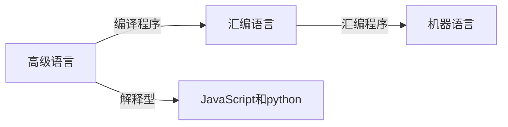

[toc]

# 一. 计算机习题概述

计算机概述：计算机系统$=$硬件$+$软件

硬件：计算机的物理性能，决定计算机性能天花板在哪

软件：计算机的虚拟性能，决定硬件性能可以发挥到什么程度。可分为系统软件和应用软件：

- 系统软件：用来管理整个计算机系统。如：操作系统，DBMS，服务程序等。
- 应用软件：按任务需要编制成的各种程序。如：微信，QQ等。

计算机功能好坏取决于"软"，"硬"件功能的总和。计算机组成原理重点讨论硬件内容。

计算硬件发展：

计算机目前的发展趋势：一方面向**更微型、多用途**方向发展；另一方面向**更巨型，超高速**方向发展。

## 1.计算机硬件的基本组成

### 1.1 冯诺依曼结构

提出设想：

> 提出"存储程序的概念"：将指令以二进制的形式先输入计算机的主存储器，然后按其在存储中的首地址执行程序的第一条指令，以后就按该程序的规定顺序执行其他指令，直到程序执行结束。

​																						 [冯诺依曼机](https://z3.ax1x.com/2021/10/11/5ZzPzD.png)

处理步骤：

1. 输入设备：将信息转化成机器能识别的形式
2. 存储器：存放数据和程序
3. 运算器：算术运算和逻辑运算
4. 控制器：指挥程序运行 
5. 输出设备：将结果输出

> 在计算机系统中，软件和硬件在逻辑上是等效的。对于同一个功能，既可以用软件实现也可以用硬件实现，但用软件实现成本低，效率也低；而用硬件实现成本高，效率也高。如：对于乘法运算，可以设计一个专门的硬件电路实现乘法运算也可以用软件的方式，执行多次加法运算来实现。

冯诺依曼计算机的特点：

1. 计算机由五大部件组成
2. 指令和数据以同等地位存于存储器，可按地址寻访
3. 指令和数据用二进制表示
4. 指令由操作码(如：加减乘除)和地址码组成
5. 存储程序：会提前将指令和程序存放到存储器中
6. 以运算器为中心：输入$/$输出设备与存储器之间的数据传送通过运算器完成。由于运算器还要完成数据中转操作，所以执行效率会降低。

### 1.2 现代计算机结构

现代计算机结构本质上是冯诺依曼结构的优化。

优化后的冯诺依曼结构：

传统冯诺依曼结构是以运算器为中心，数据传输都需要通过运算器作为中转。而现代计算机通常以存储器为中心，同时运算器和控制器之间的联系也十分紧密，所以将其结合起来就是CPU。即**CPU$=$运算器$+$控制器**。

现代计算机结构：

$I/O$设备会直接和主存储器进行数据交换。

控制器控制运算器进行数据操作(如：加减乘除)，另外也会控制主存储对CPU的读写，及输入输出设备的停止和启动。

主存储器会和CPU之间进行数据交换：一种是参与运算的数据(如：$x,y$之类的变量)。另一种是放在控制器中的指令，指令会由控制器解析其含义。

主存储器和CPU统称为主机。

现代计算机硬件结构：

上面比较混淆的是主存和辅存：这两个都是存储器，主存就是主存储器(如：运行内存)，包含在主机内；而辅存指辅助存储器(如：机械硬盘)，属于$I/O$设备。

​																		[现代冯诺依曼结构](https://z3.ax1x.com/2021/10/11/5eSbDJ.png)

[总结](https://z3.ax1x.com/2021/10/11/5epWse.png)：

## 2.各个硬件功能概况

### 2.1 主存储器

主存储器由三个部分构成：

1. 存储体：相当于"货架"部分，存储二进制数据，并根据$MAR$发送的数据地址，取出数据。
2. MAR(存储地址寄存器)：CPU将想要的数据地址存放到MAR中，即数据地址。
3. MDR(存储数据寄存器)：将存储体中取出的数据，写入MDR中，CPU可以通过数据线路从MDR中拿走数据。

存储步骤是：CPU将数据地址放入MAR中，将数据放入MDR中，之后存储体根据CPU指令将MDR中数据放入MAR指定的存储体地址中。

读取步骤是：CPU将读取地址放入MAR，存储体根据CPU指令将MAR中对应地址在存储体中找到并写入MDR中，CPU再从MDR中读取数据。

重点在存储体上：数据按地址存放在存储体中。

存储体结构：

> 存储单元：每个存储单元存放一串二进制代码。
>
> 存储字(word)：存储单元中二进制代码的组合。
>
> 存储字长：存储单元中二进制代码的位数（如：8bit，16bit，32bit，64bit）。
>
> 存储元：存储二进制的电子原件，每个存储元可存1bit。

数据在存储体中按地址存储，类似于Excel的一列表格。每个表格代表一个存储单元，每个存储单元存放一串二进制代码称为存储字，每个存储字包含多少个二进制位称为存储字长。

==注：==MAR位数反映存储单元的个数，MDR位数$=$存储字长。

例1：MAR$=$4位$\Longrightarrow$总共有$2^4$个存储单元。(4位的排列组合：4！=4`*`3*2`*`1=24)

例2：MDR$=$16位$\Longrightarrow$每个存储单元可存放$16bit$，1个字(word) $=16bit$。

==计算机基本单位：==

- 位$/$字（bit）：最小的数据单位
- 字节（Byte）：如果计算机硬件是$8$位，那么：$8$个字(bit)组成一个字节(1B$=$8b)，存储空间的最小单位。
- B：1B=8b，K：1KB = 1024B，M：1MB=1024KB，G：1GB=1024MB，T,P,E

### 2.2 运算器

用于实现算术运算(如：加减乘除)、逻辑运算(如：与或非)

有四部分构成：

- ACC：累加器，用于存放操作数，或运算结果。

- MQ：乘商寄存器，在乘除运算时，用于存放操作数或运算结果。

- X：通用的操作数寄存器，用于存放操作数。

- ALU(核心部件)：算术逻辑单元，通过内部复杂的电路实现算术运算、逻辑运算。是运算器的核心单元。

ACC、MQ、X在进行加减乘除操作区别：

|      |     加     |     减     |       乘       |      除      |
| :--: | :--------: | :--------: | :------------: | :----------: |
| ACC  | 被加数、和 | 被减数、差 |    乘积高位    | 被除数、余数 |
|  MQ  |            |            | 乘数、乘积低位 |      商      |
|  X   |    加数    |    减数    |     被乘数     |     除数     |

### 2.3 控制器

指挥各个部件，使程序可以正常运行

主要有三部分构成：

- CU(核心元件)：控制单元，分析指令，给出控制信号。是控制器核心元件。
- IR：指令寄存器，存放当前执行的指令
- PC：程序计数器，存放下一条指令的地址，有自动加$1$的功能

代码相当于指令，每完成一条指令过程：

1. 取指令(PC)

   根据PC中所记录的指令地址，从内存中取出该指令。

2. 分析指令(IR)

   将取出的指令由IR进行分析这条指令可以干什么。

3. 执行指令(CU)。

   分析完成后CU会控制其他部件完成指令具体执行。

程序在计算机中的运行过程：

> 运行顺序：PC$\Longrightarrow$MAR$\Longrightarrow$MDR$\Longrightarrow$IR$\Longrightarrow$CU$\Longrightarrow$IR$\Longrightarrow$MAR$\Longrightarrow$MDR$\Longrightarrow$ACC		
>

例：给定以下高级语言分析其在计算机内执行过程。

~~~C++
int a=2,b=3,c=1,y=0;
void main(){
    y=a*b+c;
}
~~~

代码在主存结构如下：

地址$0\sim4$是`y=a*b+c`这段程序对应的机器指令；地址$5\sim8$是四个变量$a,b,c,y$的的存储情况。这里存储字长为$16bit$。

运行步骤：

- 首先PC$=0$，执行主存地址为$0$的第一行的指令

  

  （1）$PC$存放的内容会通过地址总线传送到$MAR$中，即$(PC)\xrightarrow{0}MAR$，此时$(MAR)=0$。也就是控制器向主存指明接下来要访问的是$0$号地址所对应的指令。同时控制器会通过控制总线向主存发送读操作指令。

  （3）接着主存会根据$MAR$记录的地址到存储体中取出$0$号地址对应的二进制数据，并将二进制数据放入$MDR$当中。即$主存(MAR)\rightarrow MDR$，此时$(MDR)=000001\quad 0000000101$

  （4）$(MDR)$中存放的数据就是指令，所以这条指令会通过数据总线放入$IR$中。即$(MDR)\rightarrow IR$，导致$(IR)=000001\quad 0000000101$

  （5）$(IR)\xrightarrow{000001}CU$，$IR$将前六位的指令操作码($000001$)发送到$CU$中，$CU$分析后得知，这是取数指令。

  （6）$(IR)\xrightarrow{0000000101}MAR$，将$IR$中的数据地址码发送给$MAR$，导致$(MAR)=5$。因为$0000000101$转化十进制是$5$

  （8）$主存(MAR)\xrightarrow{5}MDR$，导致$(MDR)=0000000000000010=2$。主存根据$MAR$地址找到数据放入$MDR$中

  （9）最后在控制单元的指挥下$MDR$中的数据会被存放到$ACC$中。$(MDR)\xrightarrow{0000000000000010=2}ACC$，导致$(ACC)=0000000000000010=2$

  上面七步操作完成后$a=2$代码执行完毕。其中$1,3,4$是取指令；$5$是分析指令；$6,8,9$执行取数指令。

- 在上述取指令动作完成后，由于$PC$具有自动加$1$的功能，所以$(PC)=1$，即执行主存地址为$1$的第二行的指令

  

  此时$(PC)=1$，$(ACC)=\{a=2\}$

  （1）$PC\xrightarrow{1}MAR$，导致$(MAR)=1$

  （3）$主存(MAR)\rightarrow MDR$，导致$(MDR)=000100\quad0000000110$

  （4）$(MDR)\rightarrow IR$，导致$(IR)=000100\quad0000000110$

  （5）$(IR)\xrightarrow{000100}CU$，$IR$将前六位指令操作码$(000100)$发送给$CU$，$CU$分析后得知，这是**乘法**指令

  （6）$(IR)\xrightarrow{0000000110}MAR$，将$IR$中数据的地址吗发送到$MAR$，导致$(MAR)=0000000110=6$

  （8）$主存(MAR)\xrightarrow{6}MDR$，导致$(MDR)=0000000000000011=3$

  （9）$主存(MDR)\xrightarrow{3}MQ$，将$MDR$中的值放入乘商寄存器$MQ$当中

  （10）将$(ACC)\xrightarrow{a=2}X$，将$ACC$中$a$的值$2$放入通用寄存器$X$当中。导致$(X)=2$

  （11）$CU$通过控制线向$ALU$发送相乘指令。$(MQ)*(X)\xrightarrow{2*3=6}ACC$，导致$(ACC)=6$，如果乘积太大，需要$MQ$辅助存储。

  上面九步操作完成后$a*b$代码执行完毕。其中$1,3,4$是取指令；$5$是分析指令；$6,8,9,10,11$执行**乘法**指令。

- 在上述取指令动作完成后，由于$PC$具有自动加$1$的功能，所以$(PC)=2$，即执行主存地址为$2$的第三行的指令

  

  此时$(PC)=2$，$(ACC)=\{6\}$

  （1）$PC\xrightarrow{2}MAR$，导致$(MAR)=2$

  （3）$主存(MAR)\rightarrow MDR$，导致$(MDR)=000011\quad000000011$

  （4）$(MDR)\rightarrow IR$，导致$(IR)=000011\quad000000011$

  （5）$(IR)\xrightarrow{000011}CU$，$IR$将前六位指令操作码$(000011)$发送给$CU$，$CU$分析后得知，这是**加法**指令

  （6）$(IR)\xrightarrow{000000011}MAR$，将$IR$中数据的地址吗发送到$MAR$，导致$(MAR)=000000011=7$

  （8）$主存(MAR)\xrightarrow{7}MDR$，导致$(MDR)=0000000000000001=1$

  （9）当进行加法运算的时候$(ACC)$中会先存入被加数，通用寄存器会存放加数。$(MDR)\xrightarrow{1}X$，$(X)=1$

  （10）$CU$向$ALU$发送相加指令。$ALU$将$(ACC)$中的值与$(X)$中的值相加，再放回$(ACC)$。$(ACC)+(X)\xrightarrow{6+1=7}ACC$。导致$(ACC)=7$。

  上面八步操作完成后$a*b+c$代码执行完毕。其中$1,3,4$是取指令；$5$是分析指令；$6,8,9,10$执行**相加**指令。

- $PC$自动加$1$，所以$(PC)=3$，即执行主存地址为$3$的第四行的指令

  

  此时$(PC)=3$，$(ACC)=\{7\}$

  （1）$PC\xrightarrow{3}MAR$，导致$(MAR)=3$

  （3）$主存(MAR)\rightarrow MDR$，导致$(MDR)=000010\quad000001000$

  （4）$(MDR)\rightarrow IR$，导致$(IR)=000010\quad000001000$

  （5）$(IR)\xrightarrow{000010}CU$，$IR$将前六位指令操作码$(000010)$发送给$CU$，$CU$分析后得知，这是**存数**指令

  （6）$(IR)\xrightarrow{000001000}MAR$，将$IR$中数据的地址吗发送到$MAR$，导致$(MAR)=000001000=8$

  （7）将$ACC$中的结果通过数据总线送到$MDR$中。$(ACC)\xrightarrow{7}MDR$，$(MDR)=7$

  （9）由于是存数指令，所以$CU$会将$MDR$中的数据，存放在$MAR$所指定的地址中。$(MDR)\xrightarrow{7}地址为8的存储单元$。故$y=7$

  上面七步操作完成后$y=a*b+c$代码执行完毕。其中$1,3,4$是取指令；$5$是分析指令；$6,7,9$执行**存数**指令。

- $PC$自动加$1$，所以$(PC)=4$，即执行主存地址为$4$的第五行的指令

  

  此时$(PC)=4$

  （1）$PC\xrightarrow{4}MAR$，导致$(MAR)=4$

  （3）$主存(MAR)\rightarrow MDR$，导致$(MDR)=000110\quad000000000$

  （4）$(MDR)\rightarrow IR$，导致$(IR)=000110\quad000000000$

  （5）$(IR)\xrightarrow{000110}CU$，$IR$将前六位指令操作码$(000110)$发送给$CU$，$CU$分析后得知，这是**停机**指令

  利用中断机制通知操作系统终止该进程。

### 2.4 总结

> OP：操作码
>
> AD：地址码
>
> CPU区分指令和数据的依据：根据指令周期的不同阶段

​																										[运行汇总](https://z3.ax1x.com/2021/10/12/5nPqyV.png)

​																										[汇总二](https://z3.ax1x.com/2021/10/12/5nF48s.png)

### 2.5 计算机层次结构

> 计算机硬件层：微程序机器MO(微指令系统)------>传统机器M1(用机器语言的机器)
>
> 计算机软件层：虚拟机器M2(操作系统机器)------>虚拟机器M3(汇编语言机器)------>虚拟机器M4(高级语言机器)
>
> 硬件层位于最底层，具有下层是上层的基础，上层是下层的扩展的特点。

> 编译型程序:将高级语言编写的源程序全部语句一次全部翻译成机器语言程序，而后再执行机器语言程序（只需翻译一次)
>
> 解释型程序:将源程序的一条语句翻译成对应于机器语言的语句，并立即执行。紧接着再翻译下一句(每次执行都要翻译)

## 3. 计算机的性能指标

### 3.1 存储器的性能指标：

  > 主寄存器的容量=存储单元的个数*存储字长bit
  >
  > 例：MAR为32位，MDR为8位，总容量=2^32^*8bit=4GB

  - 32个二进制位能表示出多少种不同的状态
  
    > 1个二进制位：0，1 --------------------------------------------------------------------->2^1^																				
    >
    > 2个二进制位：00，01，10，11----------------------------------------------------->2^2^
    >
    > 3个二进制位：000，001，010，011，100，101，110，111------------>2^3^
    >
    > 32个二进制位------------------------------------------------------------------------------>2^32^

### 3.2 CPU的性能指标：

  - CPU的主频：CPU内数字脉冲信号震荡的频率，很大程度上反映了CPU的性能。如：2.9GHZ，3.7GHZ

    [CPU震荡图：](https://z3.ax1x.com/2021/10/12/5nywnJ.png)

    

    > 其中每个脉冲信号的时间称为CPU的时钟周期(微秒，纳秒)
    >
    > ==CPU主频(时钟频率)=1/CPU时钟周期(赫兹)==	
    >
    > ==时钟周期=CPU主频的倒数==
    >
    > 2.9GHZ代表CPU在一秒可以执行2.9*10^9^个周期。

  - CPI

    > 指执行一条指令所需的时钟周期数
    >
    > CPI性能是变化的：不同的指令，CPI不同。甚至相同的指令，CPI也可能有变化。 
    >
    > 执行一条指令的耗时= ==CPI*CPU时钟周期==

    例：某CPU主频为1000Hz，某程序包含100条指令，平均来看指令的CPI=3。该程序在该CPU上执行需要多久?

    > 100`*`3`*`1/1000=0.3 s
    >
    > ==CPU执行时间(一个程序的耗时)=(指令条数*CPI)/主频(时钟周期)=-CPU时钟周期数/主频==

  - IPS

    > 每秒执行多少条指令
    >
    > IPS=主频/平均CPI
    
  - FLOPS

    > 每秒执行多少次浮点运算

    **单位：**单位一般在指标名称前。如：KPS、MPS、KFLOPS…………

    **注:**此处K、M、G、T为数量单位

    ​	K=Kilo=10^3^，M=Million=10^6^，G=Giga=10^9^，T=Tera= 10^12^

### 3.3 系统整体性能指标
  - 数据通路带宽

    > :数据总线一次所能并行传送信息的位数（各硬件部件通过数据总线传输数据)

  - 吞吐量

    > 吞吐量:指系统在单位时间内处理请求的数量。
    >
    > 它取决于信息能多快地输入内存，CPU能多快地取指令，数据能多快地从内存取出或存入，以及所得结果能多快地从内存送给一台外部设备。这些步骤中的每一步都关系到主存，因此，系统吞吐量主要取决于主存的存取周期。

  - 响应时间

    > 响应时间:指从用户向计算机发送一个请求，到系统对该请求做出响应并获得它所需要的结果的等待时间。
    >
    > 通常包括CPU时间(运行一个程序所花费的时间）与等待时间（用于磁盘访问、存储器访问、/o操作、操作系统开销等时间)。

  - **注：**①主频高的CPU不一定比主频低的CPU快，如两个CPU，A的主频为2GHz，平均CPI=10;B的主频1GHz，平均CPI=1...

    ​		②若两个CPU的平均CPI相同，频率高的CPU也不一定快还要看指令系统，如A不支持乘法指令，只能用多次加法实现乘法;而			B支持乘法指令。

    ​		③基准程序(跑分软件)执行得越快也不能说明机器性能越好：基准程序中的语句存在频度差异，运行结果也不能完全说明问			题

### 3.4 总结

​																						[计算机性能指标](https://z3.ax1x.com/2021/10/13/5MVr8S.png)

# 二. 运算方法

## 1. 进位计数制

- r进制

  > 二进制:0,1
  >
  > 八进制:0,1,2,3,4,5,6,7
  >
  > 十进制:0,1,2,3,4,5,6,7,8,9
  >
  > 十六进制:0,1,2,3,4,5,6,7,8,9,A,B,C,D,E,F
  >
  > 由上可得：r进制转化为十进制公式为：==K~n~`*`r^n^+K~n-1~`*`r^n-1^+…………+K~2~`*`r^2^+k~1~`*`r^1^+K~0~`*`r^0^+K~-1~`*`r^-1^…………==

  - 例：二进制(B):101.1 ->1x2^2^+0×2^1^+1×2^0^+1×2^-1^ =5.5

    ​		八进制(O):5.4一>5×8^0^+4×8^-1^ = 5.5

    ​		十进制(D):5.5->5× 10^0^+5× 10^-1^ =5.5

    ​		十六进制(0X):5.8一>5× 16^0^+8×16^-1^ =5.5

- 二进制转化为八进制、十六进制

  - 二进制——>八进制

    > 从小数点开始向两端三位一组(因为最大排列为八)，不够补零，每组转换成对应的八进制符号
    >
    > 例：1111000010.01101
    >
    > ​	   ==<u>001</u>== ==<u>111</u>== ==<u>000</u>== ==<u>010</u>== . ==<u>011</u>== ==<u>010</u>==				
    >
    > ​		 1	  7      0     2   .   3     2 

    八进制——>二进制

    > 每位八进制对应三位的二进制
    >
    > (251.5)~8~	——>(010 101 001.101)~2~

  - 二进制——>十六进制

    > 四位一组(最大的排列为十六)，每组转换成对应的十六进制符号
    >
    > 例子：1111000010.01101
    >
    > ​			==<u>0011</u>==	==<u>1100</u>==	==<u>0010</u>== . ==<u>0110</u>==	 ==<u>1000</u>==
    >
    > ​				3		  C		  2    .     6           8

  - 十六进制 ——> 二进制

    整数部分：

    > 每位十六进制对应四位二进制
    >
    > (AE86.1)~16~ ——>(1010 1110 0110.0001)~2~

    小数部分：

    > 小数部分:乘基取整法，先取得的“整”是小数的高位

- 十进制——>任意进制

  转换：十进制/r进制得商和余数K，之后一直除直到商为0，再将余数倒叙排列。

  [75转二进制：](https://z3.ax1x.com/2021/10/14/51tY2F.png)

  [															](https://imgtu.com/i/51tY2F)

  [进制速查表：](https://z3.ax1x.com/2021/10/14/51tcxe.png)

  

- 真值和机器数

  > 真值:实际的带正负号的数值(人类习惯的样子)						+15——>==0== 1111
  >
  > 机器数︰把正负号数字化的数(存到机器里的样子)				 -15——>==1== 1000

## 2. BCD码

- 8421码

  > 快速转换：一一对应
  >
  > 十进制：13——>0001 0011

  [8421码的映射关系：](https://z3.ax1x.com/2021/10/15/589oge.png)

  

  - 8421码运算：

    > 十进制：5+8=13
    >
    > 8421码运算：0101+1000=1101
    >
    > 1101不在映射表内，所以要进行加6(0110)修正结果为13(0001 0011)

    >==注：==如果两个对应位BCD数相加的结果向高位无进位，且结果小于或等于9，则该位不需要修正;
    >
    >​		若得到的结果大于9而小于16，则该位需要加6修正。
    >
    >​		如果两个对应位BCD数相加的结果向高位有进位(结果大于或等于16),则该位需要进行加6修正。

    

## 3. 字符与字符串

> 字母，数字和字符等都是以ascll码的数字形式存储再电脑中
>
> 补充：字符数字转整型数字：'1'—'0'=1	
>
> ​			整型数字转字符数字：1+'0'='1'

[ASCLL码：](https://z3.ax1x.com/2021/10/15/58VQS0.png)

[												](https://imgtu.com/i/58VQS0)

- 字母表示

  > 字母加上各种符号，总共128个。具体如上ASCLL码

- 汉字表示

  > 国标码：专门用于汉字的ASCLL码，为了防止与字母冲突ASCLL值从128开始。
  >
  > 输入(拼音)：输入法会将输入的拼音转换为国标码，再将国标码转换为与之相对应的汉字内码。
  >
  > 输出：用到汉字字形码具体如下：

[字形码：](https://z3.ax1x.com/2021/10/15/58l16s.png)

[																			](https://imgtu.com/i/58l16s)

[总结：](https://z3.ax1x.com/2021/10/15/588Fl4.png)

## 4. 校验码

> 校验原理：指在计算机传输信息的过程中可能会发生传输数据错误的现象。(如：0变为1，1变为0)

